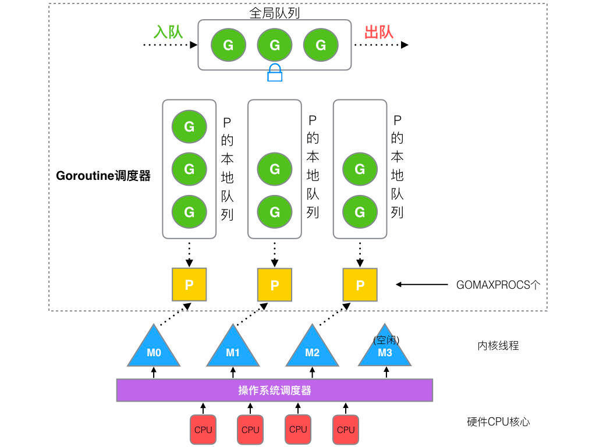
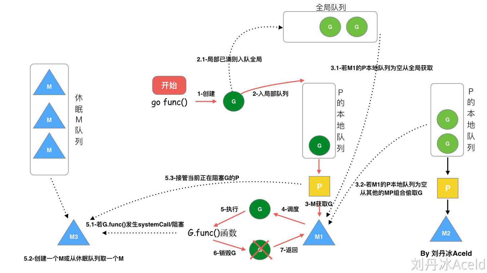
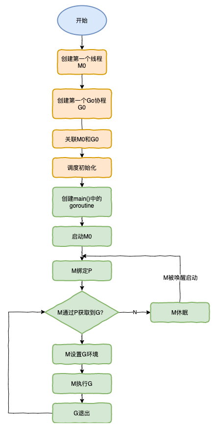

## GMP 模型
#### G：goroutine => 需要绑定 P 才能运行，在 G 的视角中，P就是 CPU

#### P：承上启下的调度器
1. 承上启下，实现 G 和 M 的动态有机结合
2. 对于 g 来说，只有被 p 调用才能运行
3. 对于 m 来说，是 m 的执行代理
4. p 的数量决定了g 的并发数量，可以用过 runtime.GOMAXPROCS 来设定

调度器的策略
1. work stealing机制 : 当本线程无可运行的g 时，尝试从其他线程绑定的 p 偷取g，而不是销毁线程
2. hand off 机制 : 当本线程因为g 进行系统调用阻塞时，就释放绑定的 p，把 p 转移给其他空闲的线程执行

#### M：machine，go 中对线程的抽象 => m 不直接执行 g，由 p 代理执行

#### GMP 模型调度的过程

1. 全局队列：存放的是等待运行的 g
2. p 的本地队列：和全局队列一样，存放的是等待运行的 g，存的数量有限，不超过 256 个。新建 g 时，g 优先加入p 的本地队列，如果队列满了，泽辉把本地队列中的一半的 g 移动到全局队列
3. p 列表：所有的 p 都在程序启动时创建，并保存到数组中，最多有 gomaxprocs（可配置） 个
4. m：线程相运行任务就得先获取 p，从 p 的本地队列获取 g，p 队列为空，m 也会尝试从全局队列拿一批 g 放到 p 的本地队列，或者从其他 p 偷取一半放到自己 p 的本地队列。m 运行 g，g 执行之后，m 会从 p 获取下一个 g，不断重复

#### go func 的调度流程

#### 调度器的生命周期

## Go 的垃圾回收机制
## Go Map 的实现