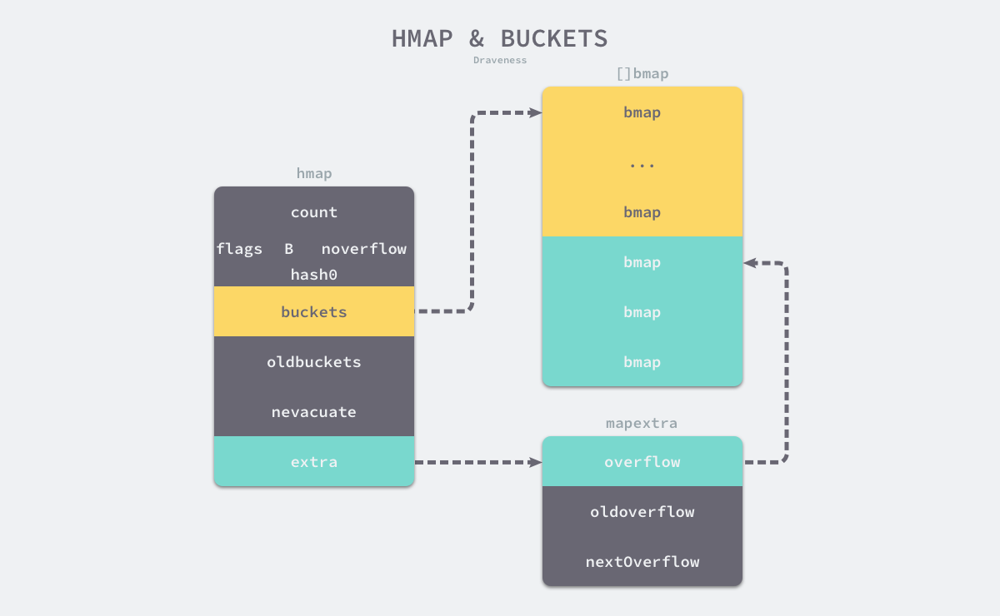

## GMP 模型
#### G：goroutine => 需要绑定 P 才能运行，在 G 的视角中，P就是 CPU

#### P：承上启下的调度器
1. 承上启下，实现 G 和 M 的动态有机结合
2. 对于 g 来说，只有被 p 调用才能运行
3. 对于 m 来说，是 m 的执行代理
4. p 的数量决定了g 的并发数量，可以用过 runtime.GOMAXPROCS 来设定

调度器的策略
1. work stealing机制 : 当本线程无可运行的g 时，尝试从其他线程绑定的 p 偷取g，而不是销毁线程
2. hand off 机制 : 当本线程因为g 进行系统调用阻塞时，就释放绑定的 p，把 p 转移给其他空闲的线程执行

#### M：machine，go 中对线程的抽象 => m 不直接执行 g，由 p 代理执行

#### GMP 模型调度的过程

1. 全局队列：存放的是等待运行的 g
2. p 的本地队列：和全局队列一样，存放的是等待运行的 g，存的数量有限，不超过 256 个。新建 g 时，g 优先加入p 的本地队列，如果队列满了，则会把本地队列中的一半的 g 移动到全局队列
3. p 列表：所有的 p 都在程序启动时创建，并保存到数组中，最多有 gomaxprocs（可配置） 个
4. m：线程相运行任务就得先获取 p，从 p 的本地队列获取 g，p 队列为空，m 也会尝试从全局队列拿一批 g 放到 p 的本地队列，或者从其他 p 偷取一半放到自己 p 的本地队列。m 运行 g，g 执行之后，m 会从 p 获取下一个 g，不断重复

#### go func 的调度流程


#### 调度器的生命周期


## Go 的垃圾回收机制
### 垃圾回收分类
1. 追踪式：从根对象出发，根据对象之间的引用关系，一步步推进知道扫描整个堆并确定要保留的对象，从而进行垃圾回收
2. 引用计数式：每个对象包含一个引用计数器，当引用计数器归零的时候就会被回收

### 根对象是什么
又叫做根集合，在垃圾回收过程中最先检查的对象：
1. 全局变量
2. 执行栈
3. 寄存器

### 三色标记法
1. 从所有根对象开始遍历，可达的先标记为灰色
2. 遍历所有灰色，变为黑色，再将可达的白色变为灰色
3. 重复第二步，直到遍历完所有对象，剩下的黑色则是可以存活的对象，白色的则是需要回收的对象

三色标记法也会存在 stw，gc 效率过低的问题，解决方法 => 写屏障、混合写屏障

如果不使用 stw ，会存在合法的对象也被 gc 给回收掉了

### 屏障机制
当以下两个条件同时满足时会破坏垃圾回收器的正确性：
1. 一个白色对象被黑色对象引用(白色被挂在黑色下)
2. 灰色对象与它之间的可达关系的白色对象遭到破坏(灰色同时丢了该白色)

为了保证gc 回收时，对象不被丢失：
1. 强三色不变式：既不存在黑色的对象引用白色的对象
2. 弱三色不变式：既所有黑色引用到的白色对象，都有可达的路径，这个白色对象必须存在其他灰色对象对它的引用，或者可达它的链路上游存在灰色对象

#### 插入屏障
满足强三色不变式：既A 对象引用对象 B，B会被标记为灰色

#### 删除屏障
满足弱三色不变式：既被删除的对象，如果自身为灰色或者白色，那么标记为灰色

#### 混合写屏障
满足变式的弱三色不变式，结合了插入屏障和删除屏障的有点，只需要在开始时并发扫描各个goroutine的栈，使其变黑并一直保持，这个过程不需要STW，而标记结束后，因为栈在扫描后始终是黑色的，也无需再进行re-scan操作了，减少了STW的时间。

流程：
1. gc 开始将栈上的所有对象标记为黑色，之后不会重复扫描，不需要stw
2. gc 期间，任何在栈上创建的对象，均为黑色
3. 被删除的对象标记为灰色【删除屏障】
4. 被添加的对象标记为回味【插入屏障】

混合写屏障机制， 栈空间不启动，堆空间启动。整个过程几乎不需要STW，效率较高

## 触发 GC 的时机是什么时候
1. 手动触发： runtime.GC
2. 被动触发：使用系统监控，当一定时间【默认时间两分钟】没有 gc 时，强制触发；通过监控内存增长的比列来触发；如果没有开启 gc，则启动 gc
## Go Map 的实现
底层用的哈希查找表，并用链表法来解决哈希冲突

基本数据结构

```go
type hmap struct {
    count     int // map中键值对的数量
    B         uint8 // 桶的数量，即哈希表中桶的个数
    noverflow uint16 // 溢出桶的数量
    hash0     uint32 // 哈希种子,它能为哈希函数的结果引入随机性，这个值在创建哈希表时确定，并在调用哈希函数时作为参数传入
    buckets   unsafe.Pointer // 桶数组的指针
    oldbuckets unsafe.Pointer // 旧桶数组的指针，用于扩容时的数据迁移
    nevacuate uintptr // 扩容时的标记位
    extra *mapextra // 附加信息，包括溢出桶和哈希表的状态等
}

type mapextra struct {
	overflow    *[]*bmap
	oldoverflow *[]*bmap
	nextOverflow *bmap
}

// 在编译期间会转化
type bmap struct {
    tophash [bucketCnt]uint8 // 存储哈希值的高8位
    keys    [bucketCnt]key   // 存储键的数组
    values  [bucketCnt]value // 存储值的数组
    overflow *bmap           // 溢出桶的指针
}
```


哈希表 runtime.hmap 的桶是 runtime.bmap。每一个 runtime.bmap 都能存储 8 个键值对，当哈希表中存储的数据过多，单个桶已经装满时就会使用 extra.nextOverflow 中桶存储溢出的数据。

桶的结构体 runtime.bmap 在 Go 语言源代码中的定义只包含一个简单的 tophash 字段，tophash 存储了键的哈希的高 8 位，通过比较不同键的哈希的高 8 位可以减少访问键值对次数以提高性能

随着哈希表存储的数据逐渐增多，我们会扩容哈希表或者使用额外的桶存储溢出的数据，不会让单个桶中的数据超过 8 个，不过溢出桶只是临时的解决方案，创建过多的溢出桶最终也会导致哈希的扩容


### map 初始化
#### 字面量
一般是通过 key：value 的方式
```go
hash := map[string]int{
	"1": 2,
	"3": 4,
	"5": 6,
}
```
当哈希表中的元素数量少于或者等于 25 个时，会将所有的键值对一次加入到哈希表中，当哈希表中元素的数量超过了 25 个，编译器会创建两个数组分别存储键和值，这些键值对会通过如下所示的 for 循环加入哈希

```go
// ageMp 为 nil，不能向其添加元素，会直接panic
var ageMp map[string]int
```

### map 的增删改查
- 增：根据hash算法查到对应的桶，如果桶没有存满，就顺序在后面存，如果存满了，则存入溢出桶，通过链表链接
- 查：根据hash算法找到对应的桶，再经过高8位找到对应的值返回，如果没有，就去溢出桶找，没有直接返回
- 删：delete
### map 中的 key 为什么是无序的
因为在遍历map 时，不是固定的从 0 的 bucket 开始遍历的，而是随机序号的 bucket 开始遍历的
### map 扩容
#### 什么时候扩容
- 装载因子大于 6.5 = 元素个数/桶的个数 => 元素太多，而桶太少
  - bucket 最大数量（2^B）直接变成原来 bucket 数量的 2 倍 (2^B *2)
- 存在太多的溢出桶
  - 等量扩容
  - 其实内存整理，清理过多的溢出桶
  - 怎么判断溢出桶太多
    - 桶 b 的个数小于 15
      - 溢出桶数量超过 2^B 
    - 桶 b 的个数大于 15
      - 溢出桶的数量超过 2^15

#### map 扩容是动态扩容
- 在调用写操作的时候增量扩容
- 从 oldbucket 迁移到 bucket 中
#### 可以对 map 边遍历边删除吗
- 不能，map 不是线程安全的；可以用 sync.RWMutex 或者 sync.Map 
#### 可以对两个 map比较吗
- 只有两个为 nil 的 map 可以比较
- 只能是遍历map 的每个元素，比较元素是否都是深度相等

### hash 算法
#### 开放寻址法
依次探测和对比目标键值是否在哈希表中
- 存在：会将值写在下一个索引为空的位置
- 不存在：就直接写到当前位置
#### 拉链法
通过 hash 算法找到一个桶
- 如果找到键相同的键值对，直接更新键值对
- 没有找到相同的键，直接在后面更新键值对，如果当前桶满了，就更新到溢出桶中
- 用的是链表做为底层的数据结构

#### float 类型可以作为 map 的 key 吗
- float 型可以作为 key，但是由于精度的问题，会导致一些诡异的问题，慎用之。


#### map 删除一个 key，它的内存会被释放吗？
不会，只会做一个标记 EmptyOne，如果 map == nil 的时候，才会被 gc 回收
## Go channel
### 数据结构
```go
type hchan struct {
  //channel分为无缓冲和有缓冲两种。
  //对于有缓冲的channel存储数据，借助的是如下循环数组的结构
	qcount   uint           // 循环数组中的元素数量
	dataqsiz uint           // 循环数组的长度
	buf      unsafe.Pointer // 指向底层循环数组的指针
	elemsize uint16 //能够收发元素的大小
  

	closed   uint32   //channel是否关闭的标志
	elemtype *_type //channel中的元素类型
  
  //有缓冲channel内的缓冲数组会被作为一个“环型”来使用。
  //当下标超过数组容量后会回到第一个位置，所以需要有两个字段记录当前读和写的下标位置
	sendx    uint   // 下一次发送数据的下标位置
	recvx    uint   // 下一次读取数据的下标位置
  
  //当循环数组中没有数据时，收到了接收请求，那么接收数据的变量地址将会写入读等待队列
  //当循环数组中数据已满时，收到了发送请求，那么发送数据的变量地址将写入写等待队列
	recvq    waitq  // 读等待队列
	sendq    waitq  // 写等待队列


	lock mutex //互斥锁，保证读写channel时不存在并发竞争问题
}
```


- 用来保存goroutine之间传递数据的循环链表。=====> buf。
- 用来记录此循环链表当前发送或接收数据的下标值。=====> sendx和recvx。
- 用于保存向该chan发送和从改chan接收数据的goroutine的队列。=====> sendq 和 recvq
- 保证channel写入和读取数据时线程安全的锁。 =====> lock

channel 出现 panic 场景：
- 向已经关闭的 channel 写数据
- 关闭已经关闭的 channel
- 关闭为 nil 的 channel

chan 出现阻塞的场景：
- 给 nil 的chan 发送数据
- 读取 nil 的 chan

## slice 的扩容机制
go.1.18 版本之前：原 slice 的容量小于 1024 的扩容 2 倍，大于 1024 的扩容 1.25 倍

新版本的 go，原容量小于 256 的，扩容 2倍，大于 256 的扩容 newcap = oldcap+(oldcap+3*256)/4

## go 中 make 和 new 的区别
都是用来分配内存的内建函数
- new： 分配空间后是将内存清零，并没有初始化内存；new 可以为每种类型分配内存；返回的是指向内存的指针
- make：分配空间之后，是初始化内存，不是清零；make 只用于 slice、map、chan 三种；make 返回的是类型；

## go context 的作用
- 上下文控制
- go goroutine 之间的数据交换
- 超时控制

## go 协程泄露的场景以及排查方法
- goroutine泄露，一般是没有被关闭或者没有添加超时控制，让 goroutine 一直阻塞，不能被 gc 回收
- 排查
  - 使用runtime.NumGoroutine()监控数量，结合pprof的goroutine profile生成堆栈跟踪。

## 如何减少GC对延迟敏感服务的影响？
- 降低分配频率，服用对象，避免频繁创建大对象
- 调整GC参数：设置GOGC（默认100，降低值减少堆增长，但增加GC频率）
- 监控工具：通过GODEBUG=gctrace=1输出GC日志，分析runtime.MemStats

## 设计一个支持百万并发的WebSocket服务
- 架构层：水平扩展+无状态设计，使用Nginx反向代理+负载均衡。
- 协议层：WebSocket over TCP，启用压缩（permessage-deflate）。
- Go实现：每个连接一个Goroutine，使用gorilla/websocket库，通过Redis Pub/Sub广播消息。

## go 中 M 的自旋机制
1. 自旋的目的
- 快速响应新任务：自旋的M可以立即处理新创建的Goroutine或从其他P窃取的G，无需等待线程唤醒。
- 减少线程切换开销：避免频繁休眠和唤醒线程（涉及操作系统调用和上下文切换）。
2. 自旋的条件 
   - M必须绑定一个P：只有持有P的M才有资格自旋，因为P是执行G的必要上下文。
   - 全局队列或其他P可能有任务：自旋的M会检查全局队列、网络轮询器（netpoller）或尝试从其他P窃取任务。
3. 自旋的流程
   - 检查本地和全局队列：
      - 首先检查当前P的本地运行队列。
      - 若本地队列为空，检查全局队列（需要加锁）。
   - 网络轮询器检查： 
     - 检查是否有就绪的网络I/O事件（通过netpoll获取关联的G）。
   - 工作窃取（Work Stealing）：
     - 随机选择其他P，尝试从其本地队列窃取一半的G。
   - 短暂忙等待：
     - 自旋期间，M会短暂循环（约几十微秒），通过原子操作或条件变量检查任务。
4. 自旋的数量限制
   - 最大自旋M数：调度器限制同时自旋的M数量为**GOMAXPROCS（即P的数量）**，防止过多CPU空转。
   - 动态调整： 
     - 当有新的G创建时，优先唤醒自旋的M。
     - 若无自旋M可用，才会创建新M或唤醒休眠的M。
5. 休眠的触发
   - 自旋超时：若自旋一段时间（如spin循环次数耗尽）后仍未找到任务，M会解除与P的绑定，进入休眠状态。
   - 休眠状态： 
     - M被放入调度器的空闲线程列表（sched.midle）。
     - 等待被唤醒（如新G创建、其他M无法窃取任务时）。
6. 唤醒机制
   - 新G创建时： 
     - 若存在自旋M，直接分配G给它。
     - 若无自旋M，唤醒休眠的M或创建新M（若未达线程数限制）。
   - 系统调用返回：
     - 当M从系统调用返回时，可能抢占其他P或触发休眠M的唤醒。

