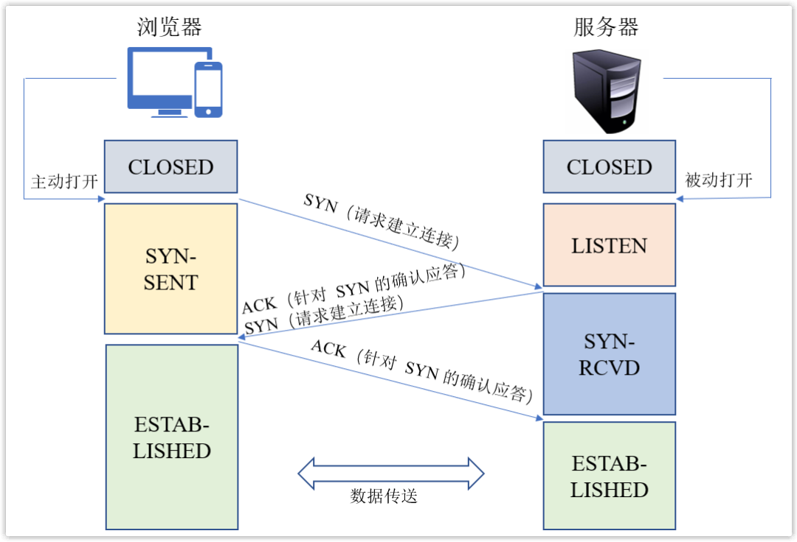
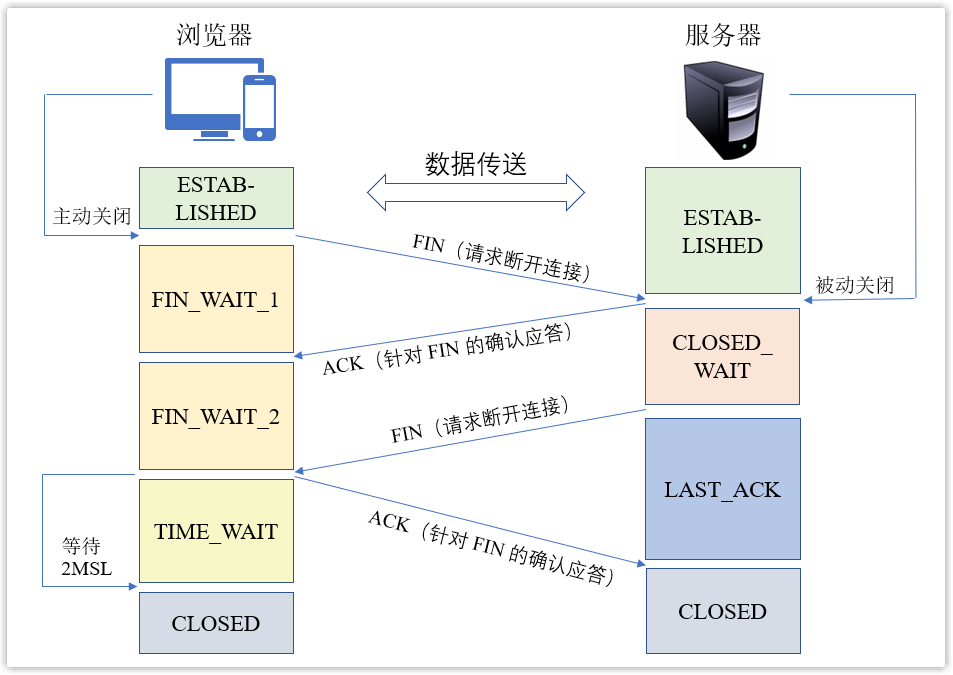
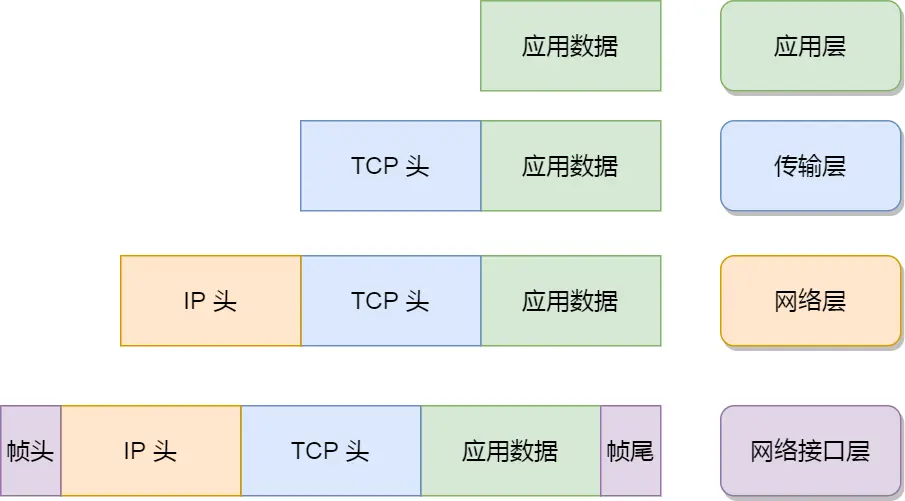
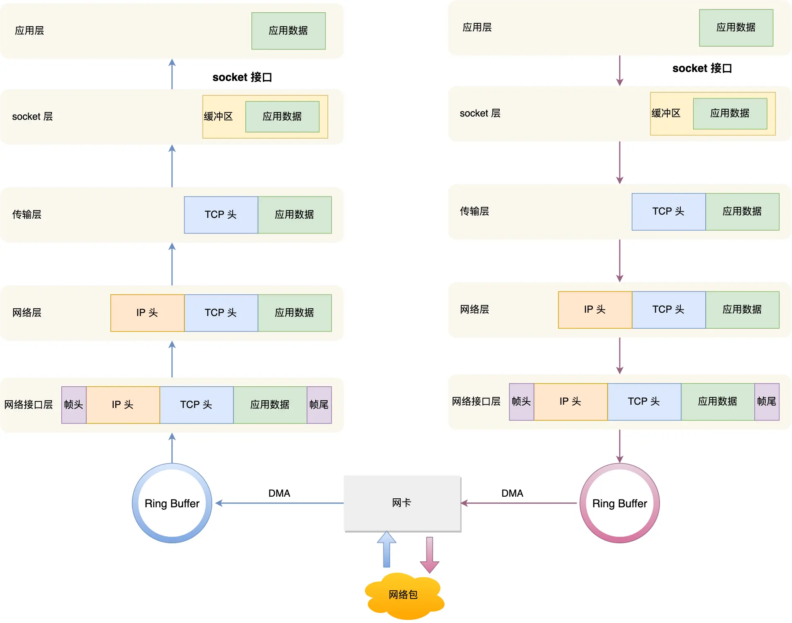
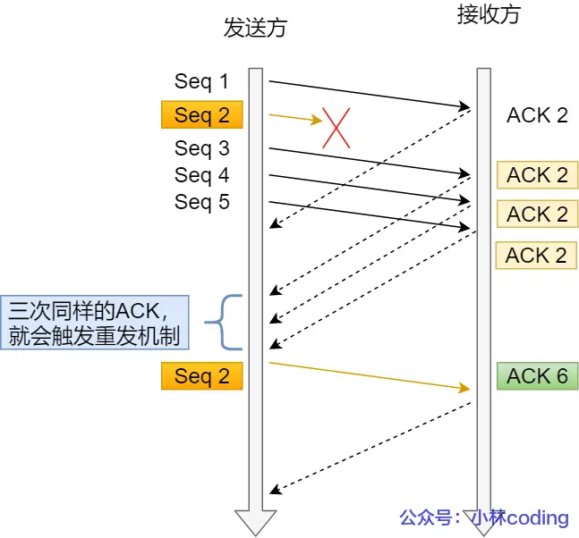
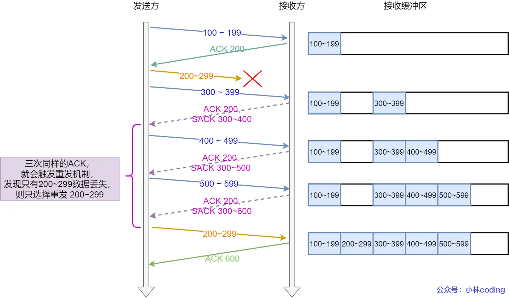

#### url 访问网站的过程
1. dns 解析，将域名解析为 ip 地址
2. tcp 连接，tcp 的三次握手
   - 由浏览器发起，告诉服务器要开始请求数据了 发起 syn
   - 由服务器发起，告诉了浏览器准备好了接收数据，可以发起请求 回复 syn 并ACK 客户端的 syn
   - 由浏览器发起，告诉服务器马上发送数据，准备接收，收到服务端的 syn，发送对服务端的 syn 的 ack
3. 发送请求
4. 接收响应
5. 渲染页面
6. 断开连接，tcp 的四次挥手
   - 由浏览器发起，告诉服务器请求报文发送完毕，准备关闭
   - 由服务器发起，告诉浏览器，请求报文接收完毕，准备关闭，你也准备关闭
   - 由服务器发起，告诉浏览器，响应报文发送完毕，你准备关闭
   - 由浏览器发起，告诉服务器，响应报文接收完毕，准备关闭

## TCP 三次握手、四次挥手
### 三次握手


### 四次挥手


#### 常见的 http 状态码

> 1xx：请求被接收
>
> 2xx：成功
>
> 3xx：重定向
>
> 4xx：客户端错误
>
> 5xx：服务器错误

```
301:永久重定向
302:临时重定向
401:权限不足，请求认证用户身份信息
403:拒绝访问
404:无法找到请求的资源
405:客户端请求中的方法被禁止
500:服务器内部错误
501:此请求方法不被服务器支持且无法被处理
502:网关错误
503:服务器繁忙
504:不能及时响应
```

#### osi 的七层模型 和 tcp/ip 四层关系

<table>
   <tr>
        <td>OSI 七层网络模型</td>
        <td>TCP/IP四层概念模型</td>
        <td>对应网络协议</td>
    </tr>
    <tr>
        <td>应用层</td>
        <td rowspan="3">应用层</td>
        <td>HTTP、TFTP, FTP, NFS, WAIS、SMTP</td>
    </tr>
    <tr>
        <td>表示层</td>
        <td>Telnet, Rlogin, SNMP, Gopher</td>
    </tr>
    <tr>
        <td>会话层</td>
        <td>SMTP, DNS</td>
    </tr>
    <tr>
        <td>传输层</td>
        <td>传输层</td>
        <td>TCP, UDP</td>
    </tr>
    <tr>
        <td>网络层</td>
        <td>网络层</td>
        <td>IP, ICMP, ARP, RARP, AKP, UUCP</td>
    </tr>
    <tr>
        <td>数据链路层</td>
        <td rowspan="2">数据链路层</td>
        <td>FDDI, Ethernet, Arpanet, PDN, SLIP, PPP</td>
    </tr>
    <tr>
        <td>物理层</td>
        <td>IEEE 802.1A, IEEE 802.2到IEEE 802.11</td>
    </tr>
</table>



#### linux 发送接受网络包流程


#### 跨域怎么出现的，怎么解决跨域

**出现**：浏览器的同源策略，限制了一个源的文件或者脚本如何和另一个源的资源进行交互，如果没有同源策略，容易收到 XSS/CSRF 等攻击
**解决**：
1. jsonp，利用 <script> 标签没有跨域限制的漏洞，页面可以动态的得到其他源的 json 数据
   - 优点：兼容性好，可以用于主流浏览器的跨域访问问题
   - 缺点：仅支持 get 方法；不安全，容易遭受 xss 攻击
2. cors 跨域资源共享，分为简单请求和复杂请求
   - 简单请求
   - 复杂请求，在正式请求之前，增加一次 http 查询请求
3. nginx 的反向代理
   配置一个代理服务器做跳板机
4. node 中间件代理（两次跨域）
   实现原理：就是服务器向服务器请求

### get 和 post 的区别
- 数据传输大小： get 传输数据的大小是 2kb，而 post 一般是没有限制的，但是会受内存大小影响，一般通过修改 php.ini 配置文件来修改
- 数据传输方式： get 是通过 url 传递参数的，在 url 中可以看到参数；post 是在表单中使用 post 方法提交
- 数据安全性：get 参数可见，容易被攻击
- 缓存： get 可以被缓存， post 不能被缓存

### HTTP/1.1、HTTP/2 和 HTTP/3 对比表

| **特性**               | HTTP/1.1                  | HTTP/2                    | HTTP/3                    |
|-------------------------|---------------------------|---------------------------|---------------------------|
| **传输层协议**          | TCP                       | TCP                       | QUIC (基于 UDP)           |
| **数据传输方式**        | 文本格式                  | 二进制帧                  | 二进制帧                  |
| **多路复用**            | ❌ 不支持（管道化有缺陷） | ✅ 支持（同一 TCP 连接）  | ✅ 支持（独立 QUIC 流）    |
| **队头阻塞**            | ⚠️ 应用层和传输层均存在   | ⚠️ 仅传输层（TCP 丢包）   | ✅ 彻底解决                |
| **头部压缩**            | ❌ 无                     | ✅ HPACK 压缩             | ✅ QPACK 压缩              |
| **服务器推送**          | ❌ 无                     | ✅ 支持                   | ✅ 支持                   |
| **握手延迟**            | ⏳ 高（TCP + TLS 1-2 RTT）| ⏳ 高（同 HTTP/1.1）      | ⚡ 低（0-1 RTT，支持 0-RTT）|
| **移动端优化**          | ❌ 无                     | ❌ 无                     | ✅ 连接迁移、抗丢包       |
| **兼容性**              | 🌍 全平台兼容             | 🌐 主流现代浏览器/服务器   | 🚧 逐步普及（需支持 QUIC） |

### 关键说明
- **多路复用**：HTTP/2 在单 TCP 连接上并行传输，HTTP/3 通过 QUIC 流彻底消除队头阻塞。
- **队头阻塞**：HTTP/1.1 因顺序处理请求而阻塞；HTTP/2 仅因 TCP 丢包阻塞；HTTP/3 无阻塞。
- **握手延迟**：HTTP/3 的 0-RTT 需已建立过连接，首次连接仍需 1-RTT。
- **移动端优化**：HTTP/3 支持 IP 切换不断连（如 Wi-Fi 切 5G），且抗弱网能力更强。

## tcp
### tcp 介绍
### tcp 三次握手
#### tcp 为什么是三次握手，不是四次或者两次
- 三次握手才能保证双方的接收和发送能力
  - 可以阻止重复历史连接的初始化
  - 可以同步双方的初始序列号
  - 避免浪费资源
#### tcp 每次握手失败，会发生什么
- 第一次握手失败（客户端发送 SYN 包），客户端发送 SYN 包后未收到 SYN-ACK 响应。
  - 客户端重传：采用 指数退避（Exponential Backoff）策略重试
  - 最终失败：客户端返回 ETIMEDOUT（连接超时）或 ECONNREFUSED（连接被拒绝）
- 第二次握手失败（服务器发送 SYN-ACK 包）
  - 服务器重传 SYN-ACK：由 tcp_synack_retries 控制重试次数（Linux 默认 5 次）。
  - 半连接队列清理：
    - 服务器维护 ​半连接队列（SYN Queue）​​ 存储未完成的握手请求。
    - 超时后（默认 60s）清除条目，释放资源。
- 第三次握手失败（客户端发送 ACK 包）​
  - 客户端：认为连接已建立，进入 ESTABLISHED 状态，可发送数据。
  - 服务器：未收到 ACK，仍处于 SYN-RECEIVED 状态，等待超时后关闭连接。
  - 若客户端发送数据，服务器因未确认连接会回复 ​RST 包，强制关闭连接。
  - 客户端收到 RST 后触发错误（如 ECONNRESET）。
#### sync 攻击是什么，怎么避免
- sync 攻击会打满半连接队列，使其他正常请求无法连接
- 解决办法：
  - 调整 netdev_max_backlog的大小
  - 增加半连接队列长度
  - 减少 SYN+ACK 重传次数（目的是让半连接队列的连接快速释放）
#### tcp 四次挥手
#### tcp 四次挥手中某次失败会发生什么
- 第一次挥手失败：客户端重传 FIN
- 第二次挥手失败：客户端会触发超时重传机制，因为 服务端 ACK 不会重传
- 第三次挥手失败：服务端会触发 FIN 重传
- 第四次挥手失败：服务端会触发 FIN 重传
#### 如果已经建立了连接，但是客户端突然出现故障了怎么办？
- 如果服务端发送数据
  - 超时重传
  - 断开连接
- 不发送数据
  - 是否开启了 keepalive，开启了，如果探测到对方已经消亡，则会断开自身的 TCP 连接
  - 没有开启，服务端的 tcp 连接会一直在，处于ESTABLISHED 状态
#### 如果已经建立了连接，但是服务端的进程崩溃会发生什么？
- 由内核来完成四次挥手的操作
#### tcp 重传机制
- 超时重传，在指定的时间内，没有收到对方的 ack 应答
  - 两种情况下会超时重传
    - 数据包丢失
    - 没有收到 ack 确认应答
  - 重传时间怎么定义
    - 根据往返时延的一个动态变化值算出来，通过采样加权平均
- 快速重传，不以时间为驱动，以数据为驱动
  - 
- SACK 方法【选择性确认】
  - 
  - 将收到的数据发送给发送方，发送方就只传丢失的数据
- Duplicate SACK，使用了 SACK 来告诉「发送方」有哪些数据被重复接收了
  - 可以让「发送方」知道，是发出去的包丢了，还是接收方回应的 ACK 包丢了;
  - 可以知道是不是「发送方」的数据包被网络延迟了;
  - 可以知道网络中是不是把「发送方」的数据包给复制了;
#### tcp 滑动窗口
- 为了解决通信效率的问题，不用等到每个请求都应答之后再次请求
- 窗口的大小，无需等待确认应答，而可以继续发送数据的最大值。
#### tcp 流量控制
- 让「发送方」根据「接收方」的实际接收能力控制发送的数据量，这就是所谓的流量控制。
#### tcp 拥塞控制
- 目的，为了防止发送方的数据填满整个网络
- 慢启动，一点一点的提高发送数据包的数量。什么时候使用慢启动，当拥塞窗口小于慢启动门限
- 拥塞避免算法，规则是：每当收到一个 ACK 时，cwnd 增加 1/cwnd。
- 拥塞发生
- 快速恢复
#### tcp 是如何解决粘包、拆包的问题
- 粘包：多个数据包被接收方一次性读取，合并为一个数据包。
- 拆包：单个数据包被分割成多个 TCP 段传输，接收方需多次读取才能完整接收。
- 根本原因：TCP 是面向流的传输协议，数据以字节流形式传输，没有明确的消息边界。发送方的写入和接收方的读取频率不匹配，导致数据在缓冲区中合并或分段。
- 解决粘包和拆包的常用方法
  - 固定长度消息法：所有消息长度固定（如每个消息 100 字节），不足部分填充空白。
  - 分隔符法：在消息末尾添加特殊分隔符（如 \n 或 \r\n）
  - 长度字段法（推荐方法）：在消息头部添加长度字段，明确标识消息体长度。
  - 协议封装法：使用标准协议（如 HTTP、Protobuf、MessagePack）定义消息结构
  - 网络框架的自动处理：成熟的网络框架（如 Netty、gRPC）内置了粘包/拆包处理机制


## udp 是什么，怎么工作的
- udp 是 用户数据报协议，其特点是 无连接、不可靠传输、轻量级、面向数据报：每个数据包独立传输（非流式）
- 应用场景
  - 实时视频/语音通话（
  - DNS 域名解析
  - 在线游戏（如 MOBA、FPS 类游戏）
  - IoT 传感器数据传输

## tcp 和 udp 有什么区别，分别应用到什么场景
- 连接方式
  - tcp 需要三次握手连接，四次挥手断开连接
  - udp 无需连接，直接发送给数据
- 可靠性
  - tcp 通过确认应答（ACK）、重传机制、数据校验等保证数据完整，丢包时会自动重传
  - udp 不可靠传输：不保证数据到达或顺序正确，丢包不重传
- 传输效率
  - tcp 传输效率较低（需维护连接状态、拥塞控制等）、延迟较高（需保证可靠性）
  - udp 传输效率高（无额外控制开销）、延迟低（实时性强）
- 数据顺序
  - tcp 保证数据顺序（通过序列号排序）、接收端按发送顺序重组排序
  - udp 不保证数据顺序
- 拥塞控制
  - tcp 有拥塞控制算法（如慢启动、拥塞避免）、网络拥塞时自动降低发送速率
  - udp 无拥塞控制，持续以固定速率发送，可能加剧网络拥堵
- 应用场景
    - tcp：要求数据完整性和顺序的场景：
      - Web 服务（HTTP/HTTPS）
      - 文件传输（FTP）
      - 远程登录（SSH
    - udp：要求低延迟、可容忍少量丢包的场景：
      - 实时通信（Zoom/Skype）
      - DNS 查询
      - 在线游戏（如 MOBA 类游戏）
## udp 如何保证可靠传输
- 序列号与确认机制（ACK）
- 超时重传与冗余传输
- 数据包排序与缓冲
- 流量控制
  - 滑动窗口机制
- 拥塞控制
