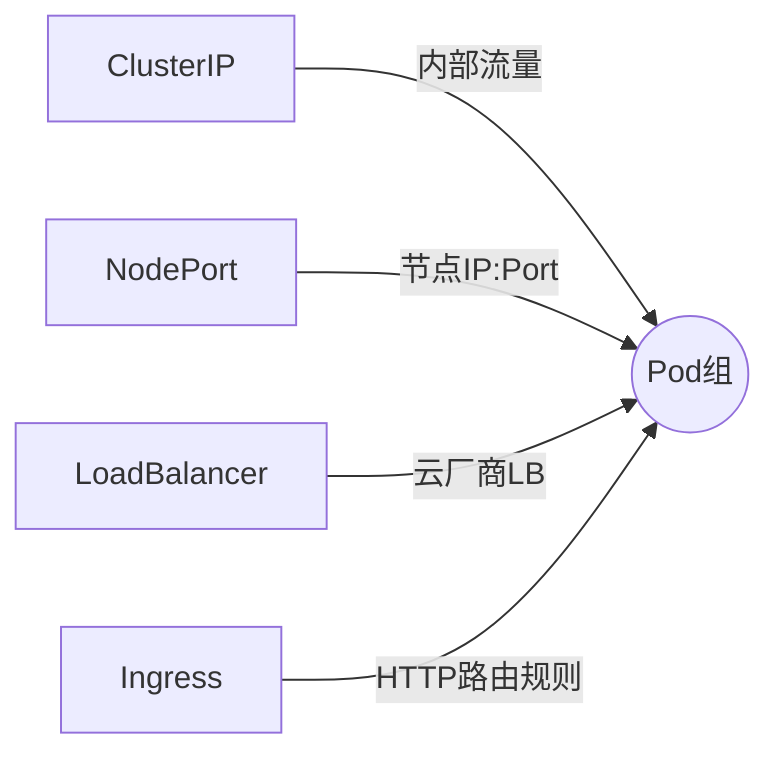
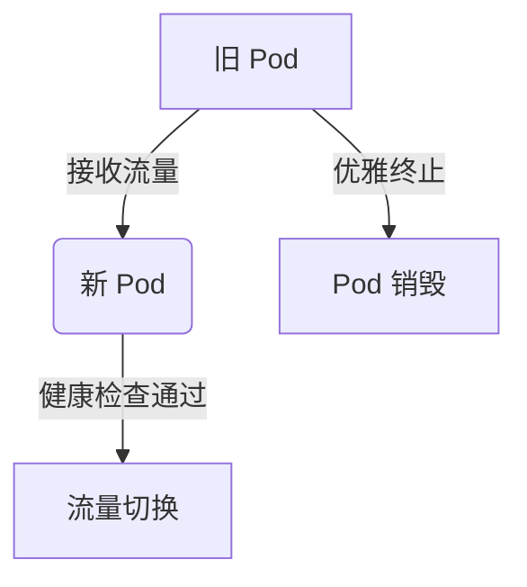

## 容器是什么
容器的本质就是进程，根据 linux 的 namespace、cgrops、rootfs隔离出来

namespace： 隔离

cgroups： 限制资源

rootfs： 根文件系统

### 容器的分层 - 7层
- 最上层：读写层，可以提交到 docker hub 上被他们修改使用，删除的文件会被写入 whiteout 中，来屏蔽这个被删除的文件
- init 层：主要是修改 /etc/hosts 等数据，不会被 commit 
- 最低下五层：只读层，rootfs 根文件系统，一般也是操作系统的文件目录

### 卷【volume】的挂载
在 rootfs 准备好之后，chroot 之前，将宿主机的目录挂载到容器中，在执行这个挂载操作，容器已经创建了，所以在宿主机上不可见，在容器内可见这个挂载事件

### 容器主要组成
- rootfs，就是容器的镜像，是容器的静态视图
- namespace+cgroups，容器运行时，是容器的动态视图

## k8s 设计与架构
- master：包含 api-server，controller-manager（控制器管理器），scheduler（调度器）
- etcd：持久化 k8s 整个集群数据
- node：kubelet（主要负责与容器运行时交互，调用网络插件和存储插件为容器配置网络和数据持久化）

k8s 的本质是 平台的平台，帮助用户构建上层平台的基础平台

## k8s 编排原理
### pod
#### 什么是 pod
是一组共享了某些资源的容器
- 共享同一个网络
- 共享同一个数据卷
- 可以同时运行一个或者多个容器，这些容器共享网络、存储等资源

#### pod 的资源共享需要启用一个中间容器
- infra 容器，永远第一个被启动，永远处于暂停状态
- 占用资源少
- 一个特殊的镜像

```markdown
# Kubernetes 实践进阶核心指南

## 目录
- [选择器（Selector）](#一选择器selector)
- [网络调度](#二网络调度)
- [容器监控](#三容器监控)
- [日常实践](#四日常实践进阶)

---

## 一、选择器（Selector）
### 1. 核心作用
✅ **服务绑定**：关联 `Service` 与目标 `Pod` 组  
✅ **标签匹配**：`selector` 必须与 `Pod.metadata.labels` **完全一致**

### 2. 配置示例
```yaml
# Service 定义片段
selector:
  environment: test  # 筛选测试环境 Pod
  app: nginx         # 筛选运行 Nginx 的 Pod

ports:
  - port: 80          # Service 暴露端口
    targetPort: 80    # Pod 端口（默认与 port 相同）
    nodePort: 30007   # Node 端口（⚠️ 仅适用于 NodePort/LoadBalancer 类型）
```

### 3. 端口对照表
| 端口类型       | 作用域             | 取值范围          | 必填  |
|----------------|--------------------|------------------|-------|
| `port`         | 集群内部访问       | 1-65535          | ✔️    |
| `targetPort`   | Pod 容器监听端口   | 同 `port` 默认值 | ❌    |
| `nodePort`     | 节点外部访问端口   | 30000-32767      | ✔️*   |

> *注：仅需在 NodePort/LoadBalancer 类型服务中显式指定

---

## 二、网络调度
### 1. Service 类型对比


### 2. 关键配置
```yaml
# Ingress 示例（需配合 Controller 使用）
apiVersion: networking.k8s.io/v1
kind: Ingress
metadata:
  name: nginx-ingress
spec:
  rules:
    - host: "foo.example.com"
      http:
        paths:
          - pathType: Prefix
            path: "/"
            backend:
              service:
                name: nginx-svc
                port:
                  number: 80
```

---

## 三、容器监控
### 1. 监控体系
```markdown
- **资源层**：`kubectl top pod/node`
- **指标层**：`Prometheus` + `Grafana` 看板
- **日志层**：`EFK` 或 `Loki` 日志聚合
- **健康检查**：
  ```yaml
  livenessProbe:   # 存活检查（失败重启）
    httpGet:
      path: /healthz
      port: 8080
  readinessProbe:  # 就绪检查（失败剔除）
    exec:
      command: ["check-ready.sh"]
  ```
```

### 2. 常用监控命令
```bash
# 实时查看 Pod 资源使用
watch kubectl top pod --namespace=production

# 查看事件日志（含调度失败原因）
kubectl get events --sort-by='.metadata.creationTimestamp'
```

---

## 四、日常实践进阶
### 1. 滚动更新流程


### 2. HPA 自动扩缩配置
```yaml
apiVersion: autoscaling/v2
kind: HorizontalPodAutoscaler
metadata:
  name: nginx-autoscaler
spec:
  scaleTargetRef:
    apiVersion: apps/v1
    kind: Deployment
    name: nginx
  minReplicas: 2
  maxReplicas: 10
  metrics:
    - type: Resource
      resource:
        name: cpu
        target:
          type: Utilization
          averageUtilization: 80
```

### 3. 调度优化技巧
```markdown
1. **节点亲和性**：
   ```yaml
   affinity:
     nodeAffinity:
       requiredDuringSchedulingIgnoredDuringExecution:
         nodeSelectorTerms:
           - matchExpressions:
               - key: gpu-type
                 operator: In
                 values: [a100]
   ```

2. **Pod 反亲和**（避免单节点部署多个实例）：
   ```yaml
   podAntiAffinity:
     requiredDuringSchedulingIgnoredDuringExecution:
       - labelSelector:
           matchExpressions:
             - key: app
               operator: In
               values: [redis]
         topologyKey: kubernetes.io/hostname
   ```
```

---

## 最佳实践总结
| 场景                | 推荐方案                          | 风险提示                      |
|---------------------|----------------------------------|-----------------------------|
| 服务暴露            | Ingress + 域名证书               | 避免滥用 NodePort            |
| 配置管理            | ConfigMap 热更新                 | 敏感数据必须用 Secret        |
| 存储管理            | PVC + StorageClass 动态供给      | 注意回收策略（Retain/Delete）|
| 零停机部署          | RollingUpdate + PreStop Hook     | 旧版本镜像需保留至少 2 个版本|

> 通过合理运用标签选择器、网络策略和监控体系，可显著提升集群稳定性。建议定期执行 `kubectl audit` 检查配置合规性。
```