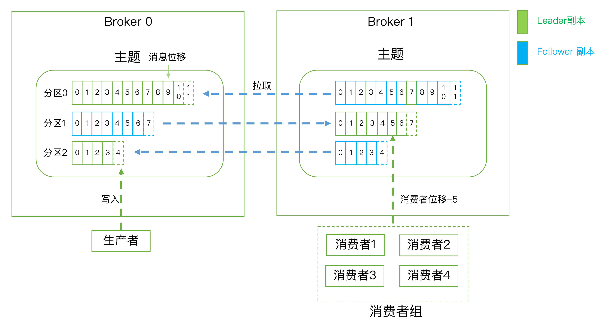
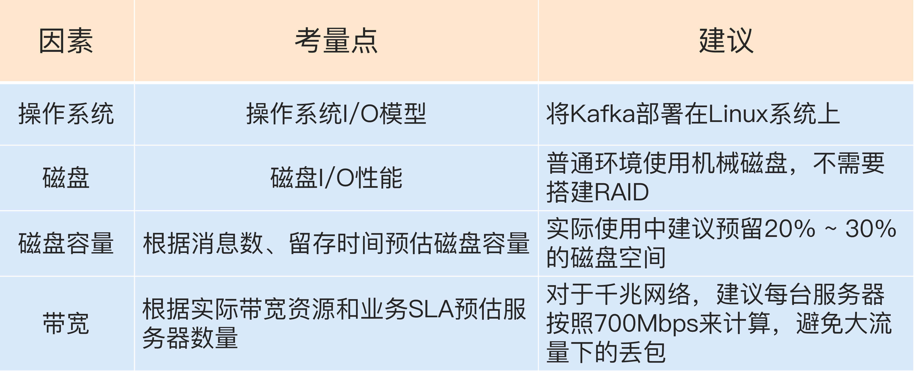
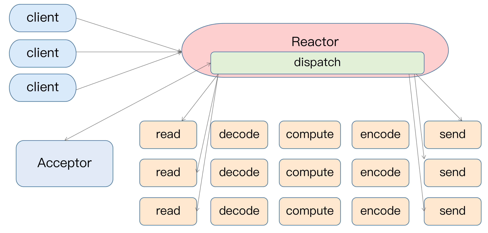
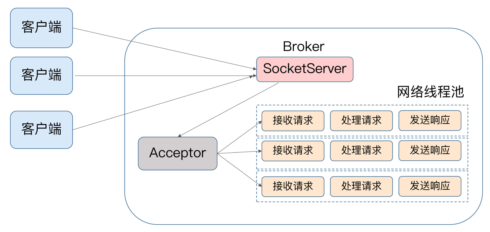
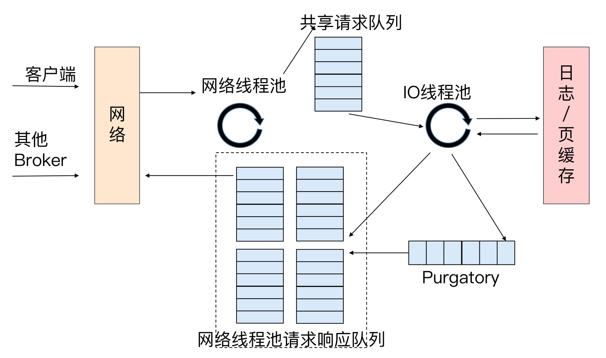
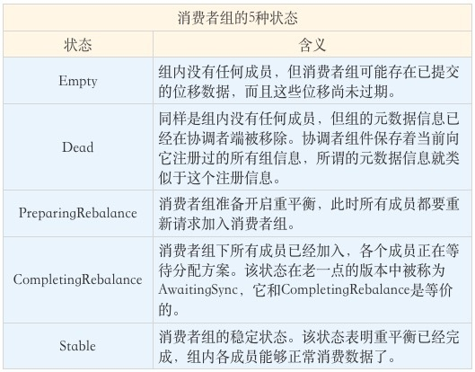
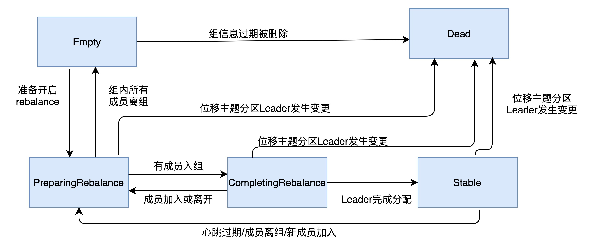

## kafka 什么
分布式的消息引擎 或者 消息队列 - 消息中间件 也是分布式流处理平台

## kafka 的消息传输协议是怎样的
- 点对点：也叫消息队列模型，A 系统的消息只能被 B 系统读取，其他任何系统不能读取 A 系统消息
- 发布/订阅模型：有一个 topic 的概念，可以有多个发布者，也可以有多个消费者

## kafka 的一些术语
- topic：主题
- producer：发布者，向 topic 发送消息的客户端程序，一般是连续不断的向一个或者多个 topic 发送消息
- consumer：消费者，向这些 topic 订阅消息的客户端程序
- Broker：kafka 的服务端，接收和处理客户端发送过来的请求，以及对消息的持久化；一个 kafka集群由多个 broker 组成，一般分布在不同的实例上。目的是为了高可用
- Replica：副本，也是 kafka 高可用的手段之一；备份机制，将相同的数据拷贝到多台机器上；副本的数量可配置；持久化或消息不丢失
  - Leader Replica（领导者副本）：对外提供服务，与客户端交互
  - Follower Replica（追随者副本）：被动地追随领导者副本，不能对外交互
  - 副本的工作机制：
    - 领导者副本：生成者向领导者副本写消息，消费者从领导者副本读消息
    - 追随者副本：向领导者副本发送请求，请求领导者把最新生产的消息发给它，这样它能保持与领导者的同步。
- Partitioning：分区（目的：伸缩性），一个有序不变的消息序列。每个主题下可以有多个分区。
- 消息位移：Offset。表示分区中每条消息的位置信息，是一个单调递增且不变的值。
- 消费者位移：Consumer Offset。表征消费者消费进度，每个消费者都有自己的消费者位移。
- 消费者组：Consumer Group。多个消费者实例共同组成的一个组，同时消费多个分区以实现高吞吐。
- 重平衡：Rebalance。消费者组内某个消费者实例挂掉后，其他消费者实例自动重新分配订阅主题分区的过程。Rebalance是Kafka消费者端实现高可用的重要手段。
- 

## kafka 线上集群部署方案怎么做

- 操作系统
  - I/O模型的使用，kafka 底层使用了Java的selector，selector在Linux上的实现机制是epoll，而在Windows平台上的实现机制是select。因此在这一点上将Kafka部署在Linux上是有优势的，因为能够获得更高效的I/O性能。
  - 网络传输：在Linux部署Kafka能够享受到零拷贝技术所带来的快速数据传输特性。
  - 社区支持
- 磁盘：
  - 新增消息数
  - 消息留存时间
  - 平均消息大小
  - 备份数
  - 是否启用压缩
- 带宽

## 集群参数怎么配置
- broker端：
  - log.dirs 

## 生产者消息分区机制
- 为什么要分区
  - 负载均衡
  - 实现高伸缩性
  - 可以保证消息的有序
  - 高吞吐量
- 分区策略
  - 轮询-》即顺序分配：轮询策略有非常优秀的负载均衡表现，它总是能保证消息最大限度地被平均分配到所有分区上，故默认情况下它是最合理的分区策略，也是我们最常用的分区策略之一。
  - 随机：
  - 按消息键保序策略：相同的 key 会被分配到同一个分区，每个分区下的消息处理都是有顺序的
  - 地理位置的分区策略

## 生产者压缩算法
它秉承了用时间去换空间的经典trade-off思想，具体来说就是用CPU时间去换磁盘空间或网络I/O传输量，希望以较小的CPU开销带来更少的磁盘占用或更少的网络I/O传输
- 怎么压缩
  - v1 版本把多条消息压缩之后，保存到外层消息的消息体字段中
  - V2，对整个消息集合压缩，更节省磁盘空间
- 何时压缩
  - 生产端
    - compression.type
  - broker 端：两种情况下才会在 broker 端压缩
    - 与生产端用了不一样的压缩算法，先解压缩再按 broker 的压缩算法压缩，可能出现 broker 端 cpu 使用率飙升
    - broker 端消息格式发生了转换；主要是为了兼容新老版本的消费者程序
- 何时解压缩
  - consumer 解压缩
  - 怎么知道这些消息是用了哪种算法？
    - kafka 会将用了哪种压缩算法封装在消息集合中
- 各种压缩算法的对比
  - 在吞吐量方面：LZ4 > Snappy > zstd和GZIP；
  - 而在压缩比方面，zstd > LZ4 > GZIP > Snappy。
- 最佳实践
  - cpu 资源充足
  - 带宽资源充足

## 无消息丢失配置
- 什么情况下保证消息不丢失
  - Kafka只对“已提交”的消息（committed message）做有限度的持久化保证。
  - 已提交：若干个 broker 成功的接收并写入日志后，会告诉生产者程序消息已经提交成功
  - 有限度的持久化保证 ：不丢失消息是有前提的，比如n 个 broker 中，至少有一个存活
- 消息丢失的情况
  - producer 端消息没有发送成功
    - 可能是网络波动，消息没有到 broker
    - 可能是消息不合格，超出了 broker 最大承受的能力
    - 可能 broker 已经宕机了
    - 解决办法：使用带回调的发送方式
  - consumer 端位移出现了问题（offset）
    - 先更新了 offset，在消费的消息
      - 解决办法：先消费消息，再更新 offset；可能出现重复消费的问题
    - 可能自动提交了位移，但是并没有消费消息
      - 手动提交
- 最佳实践
  - 使用带回调的发送消息方式
  - 设置 acks = all，需要所有副本 broker 收到消息才算 "已提交"
  - 设置一个较大的重试次数 retries
  - 设置自动定期选举 leader 副本 = false，如果一个Broker落后原先的Leader太多，那么它一旦成为新的Leader，必然会造成消息的丢失
  - 设置replication.factor >= 3，消息多保存几份
  - 设置min.insync.replicas > 1。这依然是Broker端参数，控制的是消息至少要被写入到多少个副本才算是“已提交”
  - 确保replication.factor > min.insync.replicas。如果两者相等，那么只要有一个副本挂机，整个分区就无法正常工作了。我们不仅要改善消息的持久性，防止数据丢失，还要在不降低可用性的基础上完成。推荐设置成replication.factor = min.insync.replicas + 1。
  - 确保消息消费完成再提交

## 拦截器
- 什么是拦截器
  - 其基本思想就是允许应用程序在不修改逻辑的情况下，动态地实现一组可插拔的事件处理逻辑链
- 分类；两者都支持链的方式，将一组拦截器串成一个大的拦截器
  - 生产者拦截器
    - 允许你在发送消息前以及消息提交成功后植入你的拦截器逻辑
  - 消费者拦截器
    - 支持在消费消息前以及提交位移后编写特定逻辑
- 使用场景
  - 客户端监控
  - 端到端系统性能检测
  - 消息审计等功能

## 生产者如何管理 tcp 连接
- 为什么使用 tcp 连接
  - tcp 多路复用
  - 可同时轮询多个连接
- 何时建立 tcp 连接
  - 在创建KafkaProducer实例时，生产者应用会在后台创建并启动一个名为Sender的线程，该Sender线程开始运行时首先会创建与Broker的连接
  - 连接的是 bootstrap.servers 指定的所有 broker，不需要设定太多 broker，只要与一台 broker 建立连接就能拿到集群信息
  - TCP连接还可能在两个地方被创建：
    - 一个是在更新元数据后
      - 如果发现与某些Broker当前没有连接，那么它就会创建一个TCP连接
      - 更新元数据的场景
        - 尝试给不存在的 topic 发送消息
        - 设置了 metadata.max.age.ms 参数定时更新元数据
    - 另一个是在消息发送时
      - 当要发送消息时，Producer发现尚不存在与目标Broker的连接，也会创建一个
- 何时关闭连接
  - 用户主动关闭
    - producer.close() 关闭
    - 或者 kill -9 强制关闭
  - kafka 自动关闭
    - connections.max.idle.ms 默认是 9分钟（规定时间内没有“流 ”产生），可以设置 connections.max.idle.ms=-1 禁止

## Kafka消息交付可靠性保障
- 消息交互的可靠性保证
  - 最多一次：消息可能会丢失，但绝不会被重复发送
  - 至少一次（默认）：消息不会丢失，但有可能被重复发送
  - 精确一次：消息不会丢失，不会被重复发送
    - 幂等性
      - 指的是某些操作或函数能够被执行多次，但每次得到的结果都是不变的
      - Producer 幂等，props.put(“enable.idempotence”, ture)，或props.put(ProducerConfig.ENABLE_IDEMPOTENCE_CONFIG， true)。在 broker 端多保存一些字段，匹配到相同信息自动丢弃
        - 只能保证单分区的幂等性，同一个 topic 下的同一分区
        - 只能保证单次会话幂等，不能保证跨会话幂等，当你重启了Producer进程之后，这种幂等性保证就丧失了
    - 事务：原子性（Atomicity）、一致性(Consistency)、隔离性(Isolation)和持久性(Durability)。
      - kafka的事务机制可以保证多条消息原子性地写入到目标分区，同时也能保证Consumer只能看到事务成功提交的消息。
      - 事务型 producer
        - 事务型Producer能够保证将消息原子性地写入到多个分区中。这批消息要么全部写入成功，要么全部失败
        - 不惧怕producer进程重启
        - 如何设置
          - 和幂等性Producer一样，开启enable.idempotence = true。
          - 设置Producer端参数transactional.id。最好为其设置一个有意义的名字。
          
## 消费组
- 重要特征
  - 组内可以有一个或者多个消费者实例（Consumer Instance）
  - Group ID是一个字符串，在一个Kafka集群中，它标识唯一的一个Consumer Group。
  - 消费者组订阅主题，主题的每个分区只能被组内的一个消费者消费
  - 理想情况下，Consumer实例的数量应该等于该Group订阅主题的分区总数。
- 消费组的位移
  - 对于Consumer Group而言，位移是一组KV对，Key是分区，V对应Consumer消费该分区的最新位移
  - Kafka的老版本消费者组的位移保存在Zookeeper中，好处是Kafka减少了Kafka Broker端状态保存开销。但ZK是一个分布式的协调框架，不适合进行频繁的写更新，这种大吞吐量的写操作极大的拖慢了Zookeeper集群的性能。
  - Kafka的新版本采用了将位移保存在Kafka内部主题的方法。
- 消费组的重平衡
  - 触发条件
    - 组成员发生变更，比如有新的 consumer 或者 consumer 离开/崩溃
    - 订阅的主题数发生变更；
    - 订阅主题的分区数发生变更
  - 影响：Rebalance 的设计是要求所有consumer实例共同参与，全部重新分配所有用分区。并且Rebalance的过程比较缓慢，这个过程消息消费会中止

## 位移主题
- 出现的原因
  - 老版本将位移管理依托在 zookeeper 上，consumer 重启后从 zookeeper 重新获取位移数据，但 zookeeper 不适合高频的写操作
  - 新版本（0.8.2）将位移信息保存到 consumer_offsets 主题中（内部主题）
- 作用
  - 保存consumer的消费信息
- 消息格式自定义
  - Group ID + 主题名 + 分区
- 什么时候被创建
  - 当Kafka集群中的第一个Consumer程序启动时，Kafka会自动创建位移主题。也可以手动创建
  - 默认分区：Broker端的offsets.topic.num.partitions的取值，默认为50
  - 默认副本：Broker端的offsets.topic.replication.factor的取值，默认为3
- 使用
  - kafka 提交位移信息
  - 手动提交和自动提交
    - 自动提交存在的问题：只要Consumer一直启动着，它就会无限期地向位移主题写入消息。
      - 解决：
        - 使用Compact策略来删除位移主题中的过期消息，避免该主题无限期膨胀
        - Kafka提供了专门的后台线程（Log Cleaner）定期地巡检待Compact的主题，看看是否存在满足条件的可删除数据

## 消费组重平衡
- 在重平衡过程中，STW，所有的消费组都不能消费消息
- 重平衡的弊端
  - 影响消费端的 TPS
  - Rebalance 很慢，需要所有的 consumer 参与，如果consumer 多，需要很长时间
  - reblance 效率低，全部 consumer 参与
- reblance 发生的时机
  - 组成员数量发生变化
    - 如何监听
  - 订阅主题数发生变化
  - 订阅主题的分区数发生变化
- 可以避免的 reblance
  - 未能及时发送心跳，导致Consumer被“踢出”Group而引发的
    - 设置session.timeout.ms = 6s。
    - 设置heartbeat.interval.ms = 2s。
    - 要保证Consumer实例在被判定为“dead”之前，能够发送至少3轮的心跳请求，即session.timeout.ms >= 3 * heartbeat.interval.ms。
  - Consumer消费时间过长导致的
    - max.poll.interval.ms参数值
  - 还存在不合理的 reblance，需要关注 consumer 的 gc 表现

## 位移提交
- 是什么
  - Consumer 要向Kafka汇报自己的位移数据，这个汇报过程被称为提交位移
  - Consumer需要为分配给它的每个分区提交各自的位移数据。
- 对于用户来说：手动或自动
- 对于 consumer 来说：同步或者异步

## 消费者如何管理 tcp 连接
- 什么时候创建
  - TCP连接是在调用KafkaConsumer.poll方法时被创建的
    - 发起FindCoordinator请求时。协调者（Coordinator）负责消费组的成员管理和位移管理
      - 当消费者程序首次启动调用poll方法时，它需要向Kafka集群发送一个名为FindCoordinator的请求，希望Kafka集群告诉它哪个Broker是管理它的协调者
    - 连接协调者时。只有成功连入协调者，协调者才能开启正常的组协调操作，比如加入组、等待组分配方案、心跳请求处理、位移获取、位移提交等。
    - 消费数据时。
- 创建的 tcp 连接类型
  - 确定协调者和获取集群元数据。
    - 当第三类TCP连接（执行实际的消息获取）成功创建后，消费者程序就会废弃第一类TCP连接
  - 连接协调者，令其执行组成员管理操作。
  - 执行实际的消息获取。
- 何时被关闭
  - 主动关闭
    - 手动调用KafkaConsumer.close()方法，或者是执行Kill命令
  - kafka 关闭
    - 消费者端参数connection.max.idle.ms控制的，默认9分钟，没有任何请求，如果一直循环获取 poll消费消息，就会实现长链接的效果

## 消费组消息进度监控
- 为什么要监控
  - 消费者的消费进度可能有滞后性，导致生产的速度远远大于消费的速度，造成消费积压，可能造成业务损失
  - 这个滞后程度称为：消费者Lag或Consumer Lag。
- 如何监控
  - 使用Kafka自带的命令行工具kafka-consumer-groups脚本。
    - $ bin/kafka-consumer-groups.sh --bootstrap-server <Kafka broker连接信息> --describe --group <group名称>
      - 展示的信息：主题，分区，该消费者组最新消费消息的位移值（CURRENT-OFFSET值），每个分区当前最新生产的消息的位移值（LOG-END-OFFSET）,LAG（前两者的差值），消费者实例ID，消费者连接Broker的主机名以及消费者的CLENT-ID信息。
  - 使用Kafka Java Consumer API编程。
    - 首先获取给定的消费者组的最新消费消息的位移
    - 再获取订阅分区的最新消息位移
    - 最后执行相应的减法操作，获取Lag值并封装进一个Map对象。
  - 使用Kafka自带的JMX监控指标。
    - Kafka消费者提供了一个名为kafka.consumer:type=consumer-fetch-manager-metrics,client-id=“{client-id}”的JMX指标
    - records-lag-max和records-lead-min  分别表示消费者在测试窗口时间内曾经达到的最大的Lag值和最小的Lead值。
      - Lead值是指消费者最新消费消息的位移和分区当前第一条消息的位移的差值。即：Lag越大，Lead就越小。

## kafka 的副本机制
- 副本机制有什么好处/优势
  - 提供数据冗余。即使系统部分组件失效，系统依然能够继续运转，因而增加了整体可用性以及数据持久性。
  - 提供高伸缩性。支持横向扩展，能够通过增加机器的方式来提升读性能，进而提高读操作吞吐量。
  - 改善数据局部性。允许将数据放入与用户地理位置相近的地方，从而降低系统延时。
- 副本定义
  - 所谓副本（Replica），本质就是一个只能追加写消息的提交日志
- 副本角色
  - leader 副本
    - 对外提供读写服务
  - follower 副本
    - 不对外提供读写服务
    - 拉取 leader 副本的数据，异步拉取、
    - 设计目的：
      - 方便实现“Read-your-writes”。当你使用生产者API向Kafka成功写入消息后，马上使用消费者API去读取刚才生产的消息。
        - 如果从 follower 副本读，可能不能马上看到最新写的消息（异步拉取）
      - 方便实现单调读（Monotonic Reads）。对于一个消费者用户而言，在多次消费消息时，它不会看到某条消息一会儿存在一会儿不存在。
        - 如果两个 follower 副本，如果 A 拉到了 leader 的消息，B 还未拉到，此时消费组先从 A 读，再从 B 读，就可能一会看见新消息一会看不见
  - In-sync Replicas ISR副本集合，是动态调整的
    - 与 leader 同步的副本集合
    - 如何进入 ISR
      - ISR不只是追随者副本集合，它必然包括Leader副本。甚至在某些情况下，ISR只有Leader这一个副本
      - 这个标准就是Broker端参数replica.lag.time.max.ms参数值,Follower副本能够落后Leader副本的最长时间间隔，当前默认值是10秒。
- Unclean领导者选举（Unclean Leader Election）
  - 为什么会出现
    - ISR 副本集合空了，也就是 leader 副本的 broker 挂了
  - 流程
    - Broker端参数unclean.leader.election.enable控制是否允许Unclean领导者选举。【建议不开启】
    - 从非 ISR 副本集合中选取新的 leader 副本
  - 优劣
    - 优点：保持高可用
    - 缺点：可能会丢失数据，因为不在 ISR 副本集合中的副本，已经落后 leader 副本消息太多

## 请求是怎么处理的
- 所有的请求都是通过TCP网络以Socket的方式进行通讯的。
- 常见的处理请求的两种方法
  - 顺序处理请求 -> 吞吐量差
  - 每个请求使用单独的线程处理
- kafka 的处理方式，Reactor 模式
  - Reactor模式是事件驱动架构的一种实现方式，特别适应用于处理多个客户端并发向服务端发送请求的场景
  - 
    - 多个客户端发送请求大 Reactor，reactor 中的分发线程 dispatcher（也是Acceptor？【只用于分发请求，不做逻辑处理】），将请求发送到多个工作线程
  - 
    - broker 的组件 SocketServer == dispatcher，也有工作线程池 == 网络线程池
    - 轮询的方式将请求发送到 网络线程池 中
    - 网络线程池收到请求又是怎么处理的？
      - 
      - 网络线程拿到请求后放入共享队列中，Broker端还有个IO线程池，负责从共享队列取出请求，执行
        - Producer 生产请求，写入磁盘
        - FETCH 请求，则从磁盘或页缓存中读取消息。
        - METADATA请求：返回Topic分区、Leader副本等元数据，客户端据此路由后续请求
      - 请求队列是所有网络线程共享的，而响应队列则是每个网络线程专属的
        - Purgatory 组件：它是用来缓存延时请求（Delayed Request）的。所谓延时请求，就是那些一时未满足条件不能立刻处理的请求。比如 acks=all的PRODUCE请求
- 请求分类
  - 数据类
    - PRODUCE/FETCH
  - 控制类
    - 控制类请求有这样一种能力：它可以直接令数据类请求失效！

## 消费组重平衡
- 目的：让组内所有消费者实例就消费哪些主题分区达成一致
- Coordinator 组件实现
- 触发条件
  - 组成员发生了变化（最常见），每次消费组重启，必然会发生
  - 订阅主题数发生了变化
  - 订阅主题的分区发生了变化
- 通知
  - 靠消费者端的心跳线程（Heartbeat Thread）
  - 0.10.1.0 之前的版本心跳是在消费者主线程实现的，但是消费逻辑也是在这个线程实现，如果消费逻辑耗时较长，就无法及时将心跳信息上报，导致误判
  - 0.10.1.0 之后单独设置了一个心跳线程上报
- 消费组状态机
  - 
  - 
  - 一个消费者组最开始是Empty状态，当重平衡过程开启后，它会被置于PreparingRebalance状态等待成员加入，之后变更到CompletingRebalance状态等待分配方案，最后流转到Stable状态完成重平衡。
  - 当有新成员加入或已有成员退出时，消费者组的状态从Stable直接跳到PreparingRebalance状态，此时，所有现存成员就必须重新申请加入组。
  - 所有成员退出后，变成为Empty状态
  - 只有消费组在 empty 状态，Kafka才会定期自动删除过期位移
- 流程
  - 消费者端 + 协调者端（broker）
  - 消费者端
    - 加入和等待领导者消费组分配方案
    - 领导者消费者
      - 领导者消费者的任务是收集所有成员的订阅信息，然后根据这些信息，制定具体的分区消费分配方案。
      - 第一个加入的消费者成为领导者消费者
    - JoinGroup、SyncGroup请求
    - JoinGroup请求目的：选出领导者消费者 + 收集所有成员订阅信息，制定分区方案
    - SyncGroup 请求：领导者消费者想协调者发请求（制定好的分配方案），其他消费者也要发请求（不带参数），主要目的是让所有成员都收到 SyncGroup 响应，就能知道自己该消费哪个分区
  - broker 端
    - 新成员入组
      - 发起 joinGroup，协调者返回组里 leader 信息，发起 SyncGroup 请求，返回该成员需要消费的分区信息
    - 成员主动离组
      - 发起 LeaveGroup请求，协调者返回收到并以心跳的方式通知其他成员
    - 成员奔溃离组
      - 通过心跳检测超时，然后也会以心跳的方式通知其他成员
    - 重平衡时协调者对组内成员提交位移的处理。
      - 重平衡开始，会给成员缓冲时间，在时间内上报自己的位移信息，再次开启 JoinGroup、SyncGroup请求