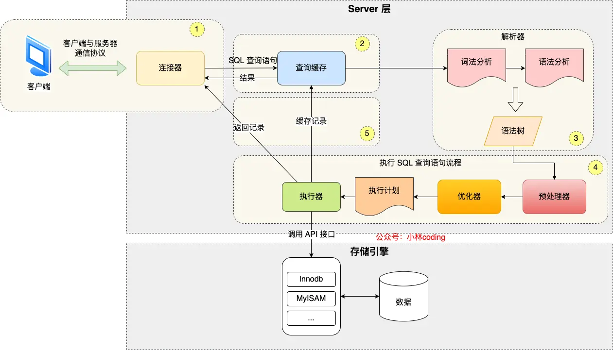
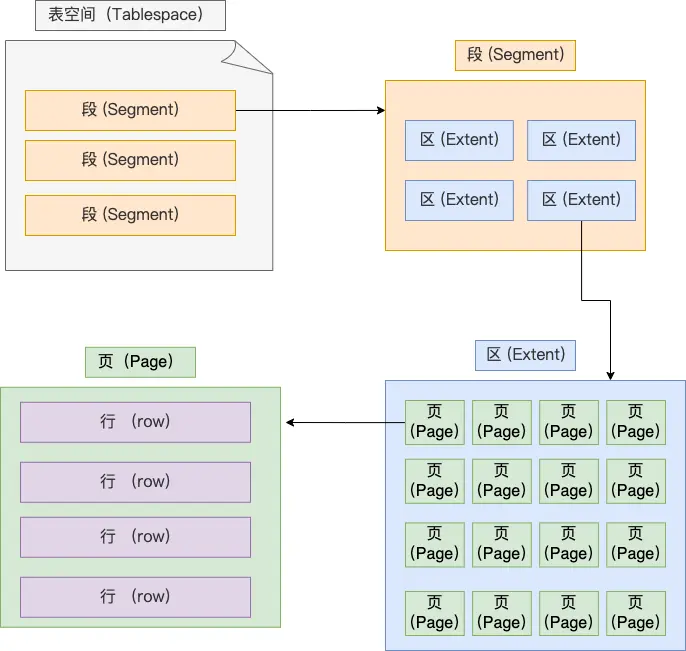
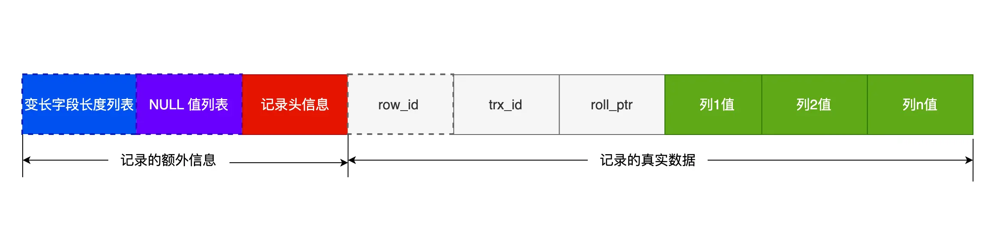
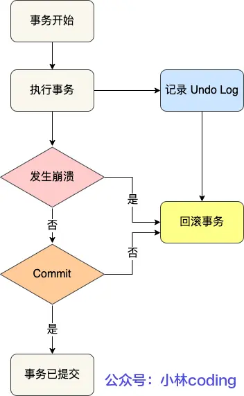
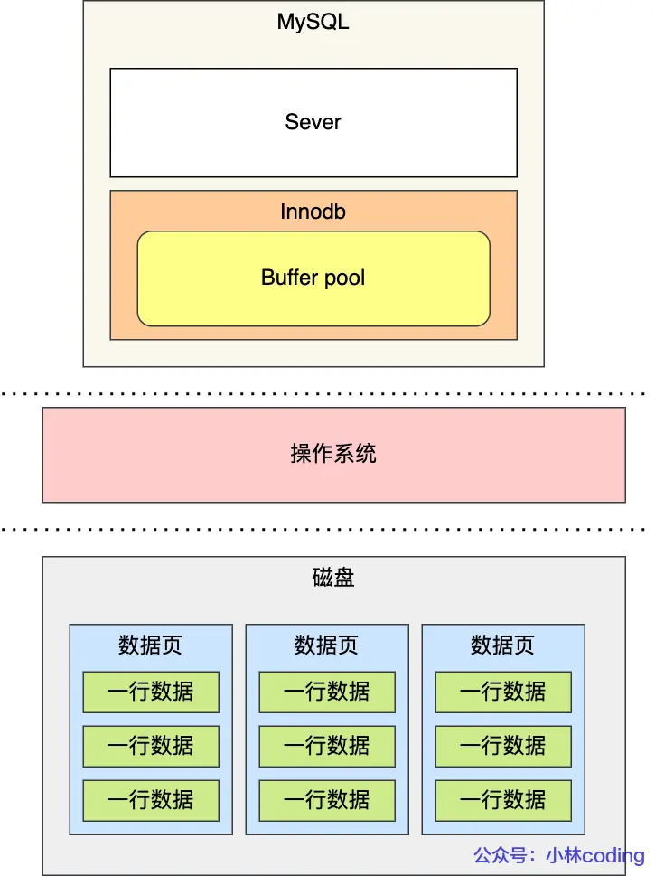
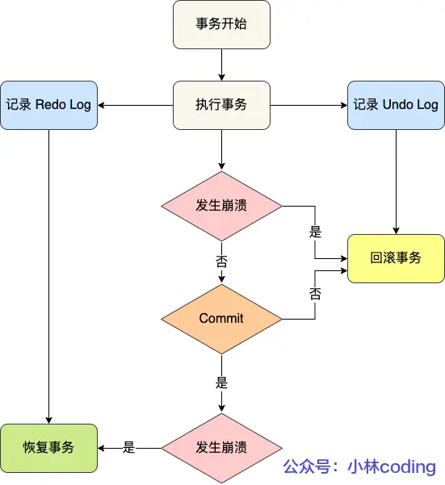
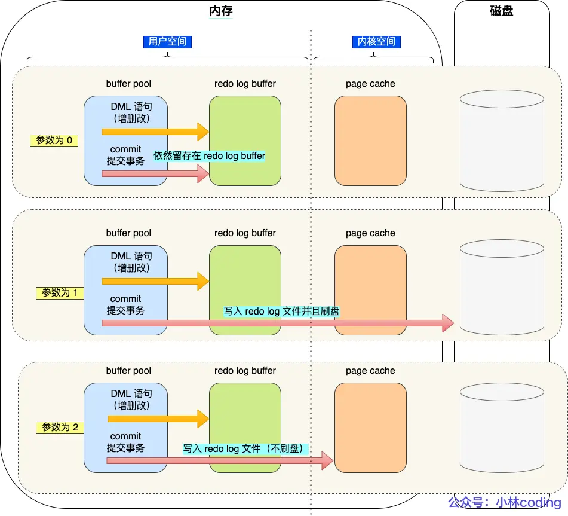
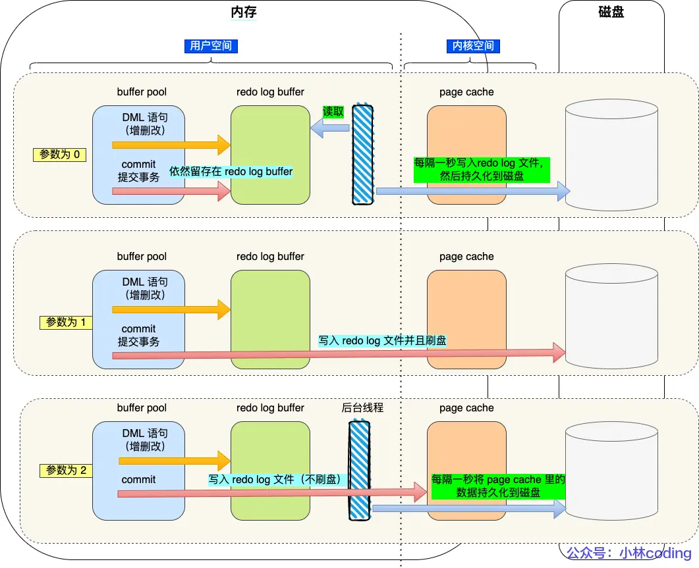
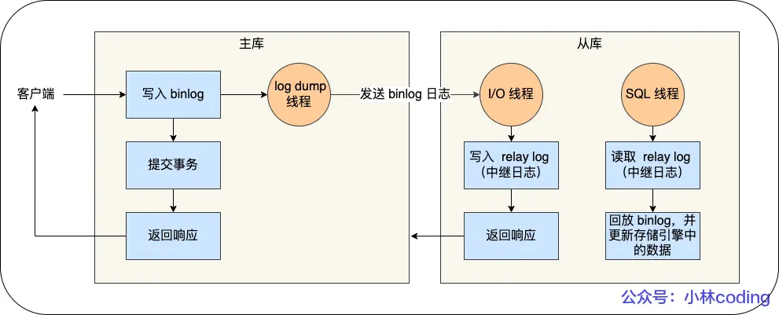

## 查询一条语句的流程

### 第一步：连接器
连接的过程要经过三次握手，因为是通过 tcp 连接的，也分为长连接【可以减少建立连接和断开的过程，也会使占用内存增多】和短连接
- 与客户端进行三次握手 tcp 连接
- 校验客户端的用户和密码
- 用户和密码正确，获取用户的权限在后面权限逻辑判断使用
#### 空闲的连接会被一直占用吗
不会，有过期时间，默认为 8 小时，通过 wait_timeout 定义。当过期之后，客户端再次请求才会返回错误
#### mysql 的连接有数量限制吗
有，默认为 151 个
#### 怎么解决长连接占用内存的问题？
- 定期断开长连接
- 客户端主动重置连接，5.7 版本之后 mysql_reset_connection()，调用可以重置连接，不需要重新鉴权，只是将连接恢复刚刚创建完的状态
### 第二步：查询缓存
8.0 之后移除了缓存；如果是查询语句，会先去缓存查，如果缓存中就直接返回，没有就继续执行，然后将查询结果缓存起来，key 是查询语句，value 是查询结果
### 第三步：解析语句
在查询之前，会被 sql 语句进行解析
#### 解析器
- 词法分析，分析出关键词和非关键词
- 语法分析，根据词法分析的结果，再根据语法规则，分析是否是满足 mysql 的语法，构建sql 语法树

表不存在或者字段不存在，是不会在解析器里判断的，在执行阶段中的预处理器中判断
### 第四步：执行语句
分为三个阶段：预处理阶段、优化阶段、执行阶段
#### 预处理器
- 检查表或者字段是是否存在
- 将 select * 中的 * 解析为表中的字段
#### 优化器
优化器主要负责将sql 查询语句的执行方案确定下来，可以用 explain 来查询执行计划
#### 执行器
执行sql 语句，从存储引擎获取记录返回给客户端

## Mysql 的一行数据是怎么存储的
### mysql 数据存放在哪个文件
- xx.idb: 表数据存放
- xx.frm： 表结构存放
- db.opt: 用来存储当前数据库的默认字符集和字符校验规则
### 表空间文件的结构是怎么样的
表空间由段（segment）、区（extent）、页（page）、行（row）组成

- 行【row】：数据库表中的数据都是按行存放的，每行根据不同行格式，有不同的存储结构
- 页【page】：数据库的读取和写入都是按页为单位，一页 16kb。页包含数据页、undo 日志页、溢出页等
- 区【extent】：Innodb 是使用 b+树来组织数据的，每一层都是用双向链表来连接，导致页与页之间的物理位置可能相隔很远，所以查询磁盘的时候有大量的随机 I/O，所以在表中数据量大的时候，为某个索引分配空间的时候就不再按照页为单位分配了，而是按照区（extent）为单位分配。每个区的大小为 1MB，对于 16KB 的页来说，连续的 64 个页会被划为一个区，这样就使得链表中相邻的页的物理位置也相邻，就能使用顺序 I/O 了。
- 段【segment】：表空间是由多个段组成，段是有多个区组成。段分为数据段、索引段、回滚段等
  - 数据段：存放 B+树叶子节点的区的集合
  - 索引段：存放B+树的非叶子节点的区的集合
  - 回滚段：存放的是回滚数据的集合
#### InnoDB 行格式有哪些？
InnoDB 提供了 4 种行格式，分别是Redundant、Compact、Dynamic和 Compressed 行格式。

- compact：一种紧凑的行格式，设计的初衷是为了让一个数据页中存放更多的数据
- Dynamic和Compressed：两个都是紧凑的行格式，和 compact 很像

#### COMPACT 行格式长什么样？

##### 记录的额外信息
- 变长字段长度列表：保存的是变长字段的真实数据占用的字节数【varchar】，是按 【逆序存放】，主要是因为「记录头信息」中指向下一个记录的指针，指向的是下一条记录的「记录头信息」和「真实数据」之间的位置，这样的好处是向左读就是记录头信息，向右读就是真实数据，比较方便。使得位置靠前的记录的真实数据和数据对应的字段长度信息可以同时在一个 CPU Cache Line 中，这样就可以提高 CPU Cache 的命中率。
- null 值列表：存储的是列数据中的 null 值，采用二进制的数据进行逆序排序
- 记录头信息
  - delete_mask：标识此条数据是否被删除
  - next_record：下一条记录的位置
  - record_type：表示当前记录的类型，0表示普通记录，1表示B+树非叶子节点记录，2表示最小记录，3表示最大记录
##### 记录的真实数据
- row_id：隐藏 id，如果没有主键或者唯一约束，innodb 就会添加 row_id,不是必须，占用 6 字节
- trx_id：事务 id，记录数据由哪个事务生成，【必需】，占用6字节
- roll_pointer：记录上个版本的指针，【必需】，占用 7 字节，用于 mvcc 版本恢复

#### 行溢出之后，mysql 是怎么处理的
- compact 行格式，会用 20字节存储溢出页的地址，包含一部分真实数据+20字节的溢出页地址
- Compressed 和 Dynamic，采用完全行溢出的方式，只存储 20字节来记录溢出页的地址，不会存储真实数据
## 索引
### 什么是索引
索引是帮助存储引擎快速获取数据的一种数据结构，也就是数据的目录
### 索引的分类
- 按数据结构：b+索引、hash 索引、full-text 索引
  - 
- 按物理存储：聚簇索引、二级索引
- 按字段特性：主键索引、唯一索引、普通索引、前缀索引
- 按字段个数：单列索引、联合索引
  - 联合索引【由多个字段组成】，使用联合索引时，存在最左匹配原则，也就是按照最左优先的方式进行索引的匹配。联合索引的最左匹配原则，在遇到范围查询（如 >、<）的时候，就会停止匹配，也就是范围查询的字段可以用到联合索引，但是在范围查询字段的后面的字段无法用到联合索引。注意，对于 >=、<=、BETWEEN、like 前缀匹配的范围查询，并不会停止匹配，前面我也用了四个例子说明了。

### explain 中字段解释
- possible_keys：可能用到的索引
- key：表示实际用到的索引，如果为 null 则是没有用索引
- key_len: 索引的长度
- rows: 表示扫描的行数
- type：表示用到的扫描的方式【效率从低到高】
  - ALl：全变扫描
  - index：全索引扫描
  - range：范围扫描
  - ref：非唯一索引扫描
  - eq_ref：唯一索引扫描
  - const：结果只有一条的主键或唯一索引扫描
### 什么时候需要索引
- 字段有唯一性的
- 经常要用在 where 后面的
- 经常用于 order by 或者 group by的，这样查询的时候就不用再次去排序
### 什么时候不需要索引
- where、order by、group by后面用不到的字段不需要索引，索引还会占用物理空间
- 字段中存在大量重复的数据或者分布比较均匀的数据【男女】
- 数据量较少的情况
- 经常更新的字段
### 什么时候索引会失效
- 使用模糊匹配，like %xx 或者 like %xx% 的时候
- 当查询条件中对索引进行了 计算、函数、类型转换操作
- 联合索引中没有使用最左匹配原则
- 在 where 子句中，or 前的列使用了索引，or 后面的列没有使用索引
### 优化索引的方法
- 前缀索引优化，将字符串的前几个字段创建索引，更快的查询速度和更少的存储空间
- 覆盖索引优化，增加联合索引，能直接查询出想要的数据，不需要回表操作，减少 I/O 操作
- 主键自增，每次插入新数据，叶子节点都是追加操作，不用重新移动数据
- 索引最好设置为 not null，索引列存在 NULL 就会导致优化器在做索引选择的时候更加复杂，更加难以优化；NULL 值是一个没意义的值，但是它会占用物理空间，所以会带来的存储空间的问题
### 索引的优缺点
优点：
- 加快查询的速度
- 加快连表的速度
- 在使用分组和排序，减少分组和排序的时间
- 减少服务器对数据的扫描
- 将随机 I/O 变成顺序 I/O

缺点：
- 需要占用物理空间，数据量越大，占用空间越多
- 创建和维护索引要消耗时间，随着数据量越大耗时越多
- 会降低表增删改的效率，因为每次增删改索引，b+树了为维护有序性，会进行动态维护


### 聚簇索引和二级索引
二级索引：存储的数据是主键 id，如果查询所有列的数据，需要做回表操作【就是先查询到主键 id，再通过主键 id 查询到相要的数据】，如果查询的数据在二级索引就能直接查到【比如主键 id】就不用做回表操作，这个叫做索引覆盖

主键索引：采用的是 b+tree 的数据格式，比二叉树的优势在于，查询效率更高，因为 b+树的最高就为 3-4层，只需要较少的 I/O
### 索引的数据结构
#### 二分查找树
二叉查找树的特点是一个节点的左子树的所有节点都小于这个节点，右子树的所有节点都大于这个节点， 但是当每次插入的元素都是二叉查找树中最大的元素，二叉查找树就会退化成了一条链表，查找数据的时间复杂度变成了 O(n)，且不支持范围查找
#### 自平衡二叉树【AVL 树】
作用：为了解决二叉查找树会在极端情况下退化成链表的问题

主要是在二叉查找树的基础上增加了一些条件约束：每个节点的左子树和右子树的高度差不能超过 1，缺陷还是每个节点只有两个字节点，随着数据增多，高度增加，增加 I/O 查询次数
#### B 树
也叫多叉树，每个节点可以有 m 个字节点【m>2】,每个节点都包含【索引+数据】，所以会更多的 I/O 操作次数来读到有用的数据，对于查询某个节点的数据，非此节点的数据也会加载到内存中，增多磁盘 I/O 操作次数，也占用内存资源
#### B+树
在 B 树的基础上升级，只在叶子节点上存放数据和索引，非叶子节点存放索引

与 b 树的差异：
  - 叶子节点（最底部的节点）才会存放实际数据（索引+记录），非叶子节点只会存放索引
  - 所有索引都会在叶子节点出现，叶子节点之间构成一个有序链表
  - 非叶子节点的索引也会同时存在在子节点中，并且是在子节点中所有索引的最大（或最小）
  - 非叶子节点中有多少个子节点，就有多少个索引

- B+树的叶子节点之间用双向链表连接，即可以向左遍历，又可以向右遍历
- B+ 树点节点内容是数据页，数据页里存放了用户的记录以及各种信息，每个数据页默认大小是 16 KB

#### MySQL 默认的存储引擎 InnoDB 采用的是 B+ 作为索引的数据结构
- B+ 树的非叶子节点不存放实际的记录数据，仅存放索引，因此数据量相同的情况下，相比存储即存索引又存记录的 B 树，B+树的非叶子节点可以存放更多的索引，因此 B+ 树可以比 B 树更「矮胖」，查询底层节点的磁盘 I/O次数会更少
- B+ 树有大量的冗余节点（所有非叶子节点都是冗余索引），这些冗余索引让 B+ 树在插入、删除的效率都更高，比如删除根节点的时候，不会像 B 树那样会发生复杂的树的变化
- B+ 树叶子节点之间用链表连接了起来，有利于范围查询，而 B 树要实现范围查询，因此只能通过树的遍历来完成范围查询，这会涉及多个节点的磁盘 I/O 操作，范围查询效率不如 B+ 树。
### count(1)和 count(*)有什么区别，哪个效率更好
count 是 mysql 中 server 层中的聚合函数，查询的是不为 null 的记录，查询到一行就 +1，

count(1)=count(*) > count(主键)> count(字段)

如果表里存在二级索引，优化器就会选择二级索引进行扫描。尽量在数据表上建立二级索引，这样优化器会自动采用 key_len 最小的二级索引进行扫描，相比于扫描主键索引效率会高一些。使用 count(字段) 来统计记录个数，因为它的效率是最差的，会采用全表扫描的方式来统计

Innodb和 MyISAM 对于 count 的区别
- MyISAM 有专门的字段 row_count 来记录行数
- Innodb 因为支持事务，没有专门的字段维护，只能遍历扫描

如何优化：
- 取近似值
- 专门维护一张表来统计
## 事务
### 什么是事务
### 事务包含的原则
- A【原子性】：一个事务中，要么全部完成，要么全部不完成，通过 undo log【回滚日志】
- C【一致性】：事务前后，数据满足完整性的约束，数据库保持一致性；一致性则是通过持久性+原子性+隔离性来保证；
- I【隔离性】：正在执行的事务对于其他事务是完全隔离的，不会相互影响，通过 mvcc【版本控制】或者锁机制来保证
- D【持久性】：事务提交之后，数据的修改是永久的，通过 redo log【重做日志】 来保证
### 并发事务导致的问题
在同时处理多个事务的时候，就可能出现脏读（dirty read）、不可重复读（non-repeatable read）、幻读（phantom read）的问题。

- 脏读
  - 一个事务读取到了另一个未提交事务修改的数据【因为这个未提交的事务可能发生回滚，修改的数据就变成了过期的数据】
- 不可重复读
  - 一个事务中多次读取同一个数据，但是前后读到的数据不一致 或者是读到了另一个事务提交的 update 数据
- 幻读
  - 一个事务中读到了其他事务中 insert 的数据或者是多次查询的数据数量不一致


SQL 标准提出了四种隔离级别来规避这些现象，隔离级别越高，性能效率就越低
### 事务的隔离级别
- 读未提交（read uncommitted），指一个事务还没提交时，它做的变更就能被其他事务看到；
- 读提交（read committed），指一个事务提交之后，它做的变更才能被其他事务看到；
- 可重复读（repeatable read），指一个事务执行过程中看到的数据，一直跟这个事务启动时看到的数据是一致的，MySQL InnoDB 引擎的默认隔离级别；
- 串行化（serializable ）；会对记录加上读写锁，在多个事务对这条记录进行读写操作时，如果发生了读写冲突的时候，后访问的事务必须等前一个事务执行完成，才能继续执行；


针对不同的隔离级别，并发事务时可能发生的现象也会不同。


对于幻读，不建议升级为 串行化的隔离级别，因为会导致数据库的并发效率很差，解决方案：
- 针对快照读【select 查询】，通过 mvcc 版本控制方式解决幻读，因为默认的隔离级别，在事务执行看到的数据和事务开始看到的数据一致
- 针对当前读【select for update】，通过 next-key lock（记录锁+间隙锁）方式解决了幻读，如果其他事务在 next-key lock 范围内插入一条数据，会被阻塞，无法插入

对于「读提交」和「可重复读」隔离级别的事务来说，它们是通过 Read View 来实现的，它们的区别在于创建 Read View 的时机不同：
- 「读提交」隔离级别是在每个 select 都会生成一个新的 Read View，也意味着，事务期间的多次读取同一条数据，前后两次读的数据可能会出现不一致，因为可能这期间另外一个事务修改了该记录，并提交了事务。
- 「可重复读」隔离级别是启动事务时生成一个 Read View，然后整个事务期间都在用这个 Read View，这样就保证了在事务期间读到的数据都是事务启动前的记录。

这两个隔离级别实现是通过「事务的 Read View 里的字段」和「记录中的两个隐藏列」的比对，来控制并发事务访问同一个记录时的行为，这就叫 MVCC（多版本并发控制）。

在可重复读隔离级别中，普通的 select 语句就是基于 MVCC 实现的快照读，也就是不会加锁的。而 select .. for update 语句就不是快照读了，而是当前读了，也就是每次读都是拿到最新版本的数据，但是它会对读到的记录加上 next-key lock 锁
### mvcc 版本控制
## 锁
### 有哪些锁
#### 全局锁
```sql
flush tables with read lock
# 释放锁
unlock tables
```
整个数据库就处于只读状态了，这时其他线程执行 对数据的增删改操作、对表结构的更改操作都会被阻塞

主要用作为全局备份，缺陷：如果数据量过大，耗时较长，会导致当前数据库只能只读，阻碍正常业务
#### 表级锁
- 表锁
- 元数据锁
- 意向锁
- AUTO-INC 锁；

##### 表锁
```sql
#表级别的共享锁,也就是读锁
lock tables t_student read;

#表级别的独占锁,也就是写锁
lock tables t_stuent write;
    
# 释放锁
unlock tables
```

对整个表加锁，会影响当前线程或其他线程对当前表的操作，造成阻塞

#### 元数据锁【MDL】
元数据锁一般不显示的调用，在对数据库操作时会自动加上 MDL 锁
- 在对一张表 curd 时，加 MDL 读锁
- 在对表结构变更时，加 MDL 写锁，写锁的优先级大于读锁

MDL 在事务提交之后才会被释放，所以如果存在长事务，可能导致线程阻塞
#### 意向锁
意向锁的目的是为了快速判断表里是否有记录被加锁。
#### 行级锁
- Record Lock：记录锁，也就是仅仅把一条记录锁上
- Gap Lock： 间隙锁，锁定一个范围，但是不包含记录本身；只存在于可重复读隔离级别，目的是为了解决可重复读隔离级别下幻读的现象。
- Next-Key Lock：Record Lock + Gap Lock 的组合，锁定一个范围，并且锁定记录本身。
- 插入意向锁：一个事务在插入一条记录的时候，需要判断插入位置是否已被其他事务加了间隙锁（next-key lock 也包含间隙锁），如果有就会被阻塞，直到拥有间隙锁的那个事务提交为止

#### update 更新没加索引的列会锁全表？
因为 innodb 的默认隔离级别为可重复读，在update 会加上next-key 锁来锁住记录本身和记录之间的“间隙”，防止其他事务在这个记录之间插入新的记录，从而避免了幻读现象，直到事务提交才会释放，如果没有索引，就会扫描全表，除了 select 可以操作，其他的操作都会被阻塞

如何避免：
- sql_safe_updates = 1 开启安全更新
  - 使用 where，where 后面的列表必须有索引
  - 使用 limit
  - 同时使用 where 和 limit，where 后的列可以不加索引
- 在测试阶段 explain 看是走的全表扫描还是索引
### 死锁
两个锁都在等对方释放资源，没有一个主动释放资源

必要的四个条件：
- 互斥
- 占有且等待
- 不可强占有
- 循环等待

如何避免：破坏四个必要条件中的一个
- 设置事务等待锁的超时时间 ； innodb_lock_wait_timeout = 10s
- 开启主动死锁检测 ；innodb_deadlock_detect = on

### 什么是悲观锁
每次去拿数据都会认为别人会修改数据，所以每次都拿数据都会上锁，适合多写的操作
### 什么时乐观锁
每次去拿数据都会认为别人不会修改数据，但是在更新数据的时候会判断在此期间有没有更新这个数据，适合多读的场景
## 日志
- undo log 回滚日志： 是 innodb 引擎生成的日志，实现事务的原子性。用作事务回滚和 mvcc 版本控制
  - 
  - 作用：
    - 实现事务回滚，保障事务的原子性
    - 实现 MVCC（多版本并发控制）关键因素之一，MVCC 是通过 ReadView【快照】 + undo log 实现的
  - 在进行 修改、删除、新增操作，事务提交之前，会记录更新前的数据到 undo log 日志中，当事务回滚时，用 undo log 日志进行回滚
- redo log 重做日志：是 innodb 引擎层生成的日志，实现了事务中的持久化，用作数据恢复
- binlog 归档日志：server 层生成的日志，主要用于数据备份和主从复制

### Buffer Pool 缓冲池，提高数据库的读写性能

- 读数据时，如果buffer pool 存在，就直接返回，如果没有存在就去磁盘读取
- 写数据时，如果 buffer pool 存在，就直接在缓存更新，然后标记为脏页（该页的内存数据和磁盘上的数据已经不一致），为了减少磁盘的 I/O，脏页的数据不会立即刷新到磁盘，是由后台系统选择合适的时机刷新到磁盘

#### buffer pool 缓存什么
在 mysql 启动的时候，innodb 会为 buffer pool 申请一批连续的内存空间，按照默认 16kb 的大小分成一个个页，buffer pool 中的页就叫做缓存页

包含
- 数据页
- 索引页
- undo 页
  - 开启事务后，innodb 更新前，都会记录相应的 undo log，如果是更新操作，需要将更新前的旧值记录到 undo log，也会写入到 buffer pool 的 undo 页，主要是用来做回滚操作
- 插入缓存项
- 自适应哈希索引
- 锁信息

#### 为什么需要 redo log
因为更新操作，会先将更新的数据写入到内存 buffer pool，此时并没有刷新到磁盘上，但是更新已经完成，如果这个时候断电或者机器故障，就会导致更新的数据丢失。

正常的流程是：更新完成之后，innodb 会在适当的时候，把 buffer pool 的脏页数据刷新到磁盘上，这个就是 wal 技术。WAL 技术指的是， MySQL 的写操作并不是立刻写到磁盘上，而是先写日志，然后在合适的时间再写到磁盘上，将随机写变成了顺序写

结论：
- 实现事务持久化的能力，让数据库有崩溃恢复的能力
- 将随机写变成了顺序写，提高了数据写入的性能

#### 什么是 redo log
是一个物理日志，记录了数据页更新了什么内容

#### redo log 和 undo log 的区别
- redo log 记录的是事务提交后，更新完成之后的数据
- undo log 记录的是事务开始前，更新之前的数据

事务提交之前发生了崩溃，重启后会通过 undo log 回滚事务，事务提交之后发生了崩溃，重启后会通过 redo log 恢复事务


#### 产生的 redo log 是直接写入磁盘的吗？
不是的，redo log 的日志也会写入自己的缓存 redo log buffer，后续在持久化到磁盘，因为每次 redo log 都写入磁盘，I/O 开销大

#### redo log 什么时候刷盘？
- mysql 正常关闭的时候
- 当 redo log buffer 记录的写入量大于 redo log buffer 内存一半时
- innodb 后台线程 每隔 1s 就像 redo log buffer 写入磁盘
- 每次事务提交就将 redo log buffer 写入磁盘，由参数 innodb_flush_log_at_trx_commit 控制，默认值是 1
  - 参数为 0 时，表示每次事务提交，将 redo log 写入在 redo log buffer，不会写入磁盘
  - 参数为 1 时，表示每次事务提交就将缓存到 redo log buffer 中的日志写入磁盘中，持久化
  - 参数为 2 时，表示每次事务提交，会将 redo log buffer 的日志写入 redo log 文件中，并不是写入到磁盘，是写入到了操作系统的文件缓存中


#### innodb_flush_log_at_trx_commit 为 0 和 2 的时候，什么时候才将 redo log 写入磁盘？
innodb 每隔 1s：
- 参数为 0，会通过 write()先写入操作系统的 page cache，然后在 fsync() 写入磁盘，如果数据库崩溃，会丢失 1s 的数据
- 参数为 2，通过 fsync() 写入磁盘，如果操作系统崩溃，才会丢失 1s 的数据



#### redo log 写满了怎么办
innodb 一个重做文件组【redo log group】，由 ib_logfile0 和 ib_logfile1 组成，通过循环写的方式写入日志，如果redo log 中的数据已经刷入磁盘，那么就会被删除。如果 redo log 文件满了，就不会再往里写数据，造成数据库阻塞，这个时候会停下来将脏页的数据刷新到磁盘中，腾出空间，主要由两个参数控制，一个记录写的位置 write pos，一个记录需要擦除的位置 checkpoint

### 为什么需要 binlog 日志
mysql 在完成一条更新操作之后，会生成一条 binlog 日志，事务提交之后会将 binlog 日志记录到 binlog 文件中，binlog 记录的是所有数据库表结构变更和表数据修改的日志，不会记录查询操作

#### redo log 和 binlog 的区别
- redo log 是在 innodb 引擎层实现的，binlog 是在 server 层实现，所有引擎都可以用
- redo log 是物理日志，记录的是在某个数据页做了什么更新操作，binlog 记录的是所有数据库表结构和数据的更新操作
- binlog 是追加写入，redo log 是循环写入
- binlog 的主要作用是用作备份数据和主从复制，redo log 是用于崩溃恢复
#### 主从数据库流程

- 写入 binlog 日志：主库记录 binlog 日志，更新本地数据
- 复制 binlog 日志：主库把 binlog 日志复制到每个从库上，从库保存在中继日志中
- 回放 binlog 日志：回放 binlog 日志，并更新引擎中的数据

主库事务提交之后，将操作写入 binlog 日志中，从库起一个 I/O 线程连接主库的 log dump 线程，将 binlog 日志复制到从库的 repay log 日志中，再起一个线程将中继日志中的数据更新到存储引擎中，实现主从数据一致性

##### MySQL 主从复制还有哪些模型？
- 同步复制：主库提交事务要等所有从库响应复制成功，才会返回客户端
- 异步复制（默认模型）：binlog 日志异步复制给从库，但是这种一旦主库出问题就会导致数据丢失
- 半同步复制：MySQL 5.7 版本之后，不用等所有从库返回复制成功，只要一部分复制成功响应回来就行

#### binlog 什么时候刷入磁盘
事务提交的时候会先将 binlog 写入到 binlog cache 日志中，然后在写入 binlog 文件，这个时候并没有写入磁盘，最后是通过系统写入磁盘，这个时候通过一个参数 sync_binlog 来控制写入时机

- 参数为 0时：每次提交事务只 write()，不 fsync()，由操作系统择机写入磁盘
- 参数为 1时：每次提交都会 write，然后马上同步到磁盘
- 参数为 n 时：每次事务提交都会 write，但是要积累到 n 个才写入磁盘
## 分表分库的流程
- 水平分表分库
  - 按数据的范围进行区分
- 垂直分表分库
  - 按字段的类型进行区分

## 数据库的三大范式
- 保证每一列都是不可再分的属性
- 保证每一列都依赖主键
- 保证每一列都和主键有直接的关系，而不是间接关系

### 如果 MySQL 的性能突然下降，但 CPU、内存、IO 均正常，可能是什么原因？
  - 锁竞争（大量行锁/表锁）
  - 长事务阻塞
  - 索引失效
  - 查询优化器选错索引
  - 网络抖动等。

### 设计一个支持千万级用户在线的高并发点赞系统，如何保证性能和一致性？
 - 异步写入
 - Redis 计数器
 - 定期同步到 MySQL，避免频繁更新数据库。
