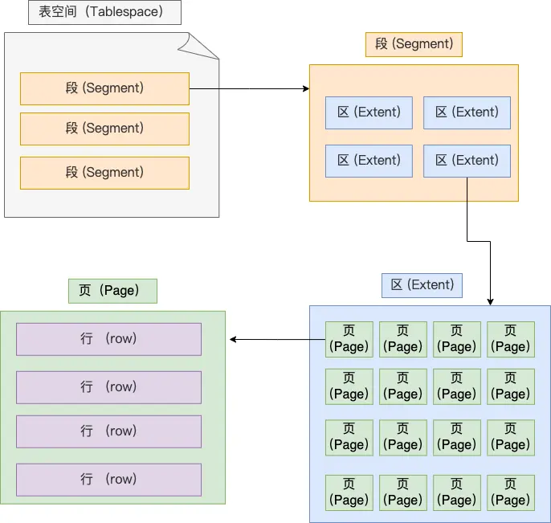

## 查询一条语句的流程

### 第一步：连接器
连接的过程要经过三次握手，因为是通过 tcp 连接的，也分为长连接【可以减少建立连接和断开的过程，也会使占用内存增多】和短连接
- 与客户端进行三次握手 tcp 连接
- 校验客户端的用户和密码
- 用户和密码正确，获取用户的权限在后面权限逻辑判断使用
#### 空闲的连接会被一直占用吗
不会，有过期时间，默认为 8 小时，通过 wait_timeout 定义。当过期之后，客户端再次请求才会返回错误
#### mysql 的连接有数量限制吗
有，默认为 151 个
#### 怎么解决长连接占用内存的问题？
- 定期断开长连接
- 客户端主动重置连接，5.7 版本之后 mysql_reset_connection()，调用可以重置连接，不需要重新鉴权，只是将连接恢复刚刚创建完的状态
### 第二步：查询缓存
8.0 之后移除了缓存；如果是查询语句，会先去缓存查，如果缓存中就直接返回，没有就继续执行，然后将查询结果缓存起来，key 是查询语句，value 是查询结果
### 第三步：解析语句
在查询之前，会被 sql 语句进行解析
#### 解析器
- 词法分析，分析出关键词和非关键词
- 语法分析，根据词法分析的结果，再根据语法规则，分析是否是满足 mysql 的语法，构建sql 语法树

表不存在或者字段不存在，是不会在解析器里判断的，在执行阶段中的预处理器中判断
### 第四步：执行语句
分为三个阶段：预处理阶段、优化阶段、执行阶段
#### 预处理器
- 检查表或者字段是是否存在
- 将 select * 中的 * 解析为表中的字段
#### 优化器
优化器主要负责将sql 查询语句的执行方案确定下来，可以用 explain 来查询执行计划
#### 执行器
执行sql 语句，从存储引擎获取记录返回给客户端

## Mysql 的一行数据是怎么存储的
### mysql 数据存放在哪个文件
- xx.idb: 表数据存放
- xx.frm： 表结构存放
- db.opt: 用来存储当前数据库的默认字符集和字符校验规则
### 表空间文件的结构是怎么样的
表空间由段（segment）、区（extent）、页（page）、行（row）组成

- 行【row】：数据库表中的数据都是按行存放的，每行根据不同行格式，有不同的存储结构
- 页【page】：数据库的读取和写入都是按页为单位，一页 16kb。页包含数据页、undo 日志页、溢出页等
- 区【extent】：Innodb 是使用 b+树来组织数据的，每一层都是用双向链表来连接，导致页与页之间的物理位置可能相隔很远，所以查询磁盘的时候有大量的随机 I/O，所以在表中数据量大的时候，为某个索引分配空间的时候就不再按照页为单位分配了，而是按照区（extent）为单位分配。每个区的大小为 1MB，对于 16KB 的页来说，连续的 64 个页会被划为一个区，这样就使得链表中相邻的页的物理位置也相邻，就能使用顺序 I/O 了。
- 段【segment】：表空间是由多个段组成，段是有多个区组成。段分为数据段、索引段、回滚段等
  - 数据段：存放 B+树叶子节点的区的集合
  - 索引段：存放B+树的非叶子节点的区的集合
  - 回滚段：存放的是回滚数据的集合
#### InnoDB 行格式有哪些？
InnoDB 提供了 4 种行格式，分别是Redundant、Compact、Dynamic和 Compressed 行格式。

- compact：一种紧凑的行格式，设计的初衷是为了让一个数据页中存放更多的数据
- Dynamic和Compressed：两个都是紧凑的行格式，和 compact 很像

#### COMPACT 行格式长什么样？

##### 记录的额外信息
- 变长字段长度列表：保存的是变长字段的真实数据占用的字节数【varchar】，是按 【逆序存放】，主要是因为「记录头信息」中指向下一个记录的指针，指向的是下一条记录的「记录头信息」和「真实数据」之间的位置，这样的好处是向左读就是记录头信息，向右读就是真实数据，比较方便。使得位置靠前的记录的真实数据和数据对应的字段长度信息可以同时在一个 CPU Cache Line 中，这样就可以提高 CPU Cache 的命中率。
- null 值列表：存储的是列数据中的 null 值，采用二进制的数据进行逆序排序
- 记录头信息
  - delete_mask：标识此条数据是否被删除
  - next_record：下一条记录的位置
  - record_type：表示当前记录的类型，0表示普通记录，1表示B+树非叶子节点记录，2表示最小记录，3表示最大记录
##### 记录的真实数据
- row_id：隐藏 id，如果没有主键或者唯一约束，innodb 就会添加 row_id,不是必须，占用 6 字节
- trx_id：事务 id，记录数据由哪个事务生成，【必需】，占用6字节
- roll_pointer：记录上个版本的指针，【必需】，占用 7 字节，用于 mvcc 版本恢复

#### 行溢出之后，mysql 是怎么处理的
- compact 行格式，会用 20字节存储溢出页的地址，包含一部分真实数据+20字节的溢出页地址
- Compressed 和 Dynamic，采用完全行溢出的方式，只存储 20字节来记录溢出页的地址，不会存储真实数据
## 索引
### 什么是索引
索引是帮助存储引擎快速获取数据的一种数据结构，也就是数据的目录
### 索引的分类
- 按数据结构：b+索引、hash 索引、full-text 索引
  - 
- 按物理存储：聚簇索引、二级索引
- 按字段特性：主键索引、唯一索引、普通索引、前缀索引
- 按字段个数：单列索引、联合索引
  - 联合索引【由多个字段组成】，使用联合索引时，存在最左匹配原则，也就是按照最左优先的方式进行索引的匹配。联合索引的最左匹配原则，在遇到范围查询（如 >、<）的时候，就会停止匹配，也就是范围查询的字段可以用到联合索引，但是在范围查询字段的后面的字段无法用到联合索引。注意，对于 >=、<=、BETWEEN、like 前缀匹配的范围查询，并不会停止匹配，前面我也用了四个例子说明了。

### explain 中字段解释
- possible_keys：可能用到的索引
- key：表示实际用到的索引，如果为 null 则是没有用索引
- key_len: 索引的长度
- rows: 表示扫描的行数
- type：表示用到的扫描的方式【效率从低到高】
  - ALl：全变扫描
  - index：全索引扫描
  - range：范围扫描
  - ref：非唯一索引扫描
  - eq_ref：唯一索引扫描
  - const：结果只有一条的主键或唯一索引扫描
### 什么时候需要索引
- 字段有唯一性的
- 经常要用在 where 后面的
- 经常用于 order by 或者 group by的，这样查询的时候就不用再次去排序
### 什么时候不需要索引
- where、order by、group by后面用不到的字段不需要索引，索引还会占用物理空间
- 字段中存在大量重复的数据或者分布比较均匀的数据【男女】
- 数据量较少的情况
- 经常更新的字段
### 什么时候索引会失效
- 使用模糊匹配，like %xx 或者 like %xx% 的时候
- 当查询条件中对索引进行了 计算、函数、类型转换操作
- 联合索引中没有使用最左匹配原则
- 在 where 子句中，or 前的列使用了索引，or 后面的列没有使用索引
### 优化索引的方法
- 前缀索引优化，将字符串的前几个字段创建索引，更快的查询速度和更少的存储空间
- 覆盖索引优化，增加联合索引，能直接查询出想要的数据，不需要回表操作，减少 I/O 操作
- 主键自增，每次插入新数据，叶子节点都是追加操作，不用重新移动数据
- 索引最好设置为 not null，索引列存在 NULL 就会导致优化器在做索引选择的时候更加复杂，更加难以优化；NULL 值是一个没意义的值，但是它会占用物理空间，所以会带来的存储空间的问题
### 索引的优缺点
有点：
缺点：
- 需要占用物理空间，数据量越大，占用空间越多
- 创建和维护索引要消耗时间，随着数据量越大耗时越多
- 会降低表增删改的效率，因为每次增删改索引，b+树了为维护有序性，会进行动态维护
### 聚簇索引和二级索引
二级索引：存储的数据是主键 id，如果查询所有列的数据，需要做回表操作【就是先查询到主键 id，再通过主键 id 查询到相要的数据】，如果查询的数据在二级索引就能直接查到【比如主键 id】就不用做回表操作，这个叫做索引覆盖
主键索引：采用的是 b+tree 的数据格式，比二叉树的优势在于，查询效率更高，因为 b+树的最高就为 3-4层，只需要较少的 I/O
### 索引的数据结构
B+树
## 事务
### 什么是事务
### 事务包含的原则
### 并发事务导致的问题
### 事务的隔离级别
### mvcc 版本控制
## 锁
### 有哪些锁
### 怎么加锁
### 什么是悲观锁
### 什么时乐观锁
## 分表分库的流程
## 主从数据库流程
## 不同