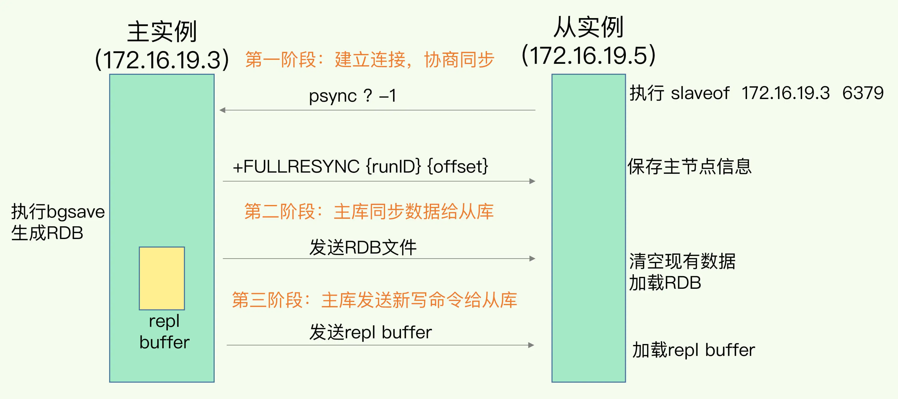

## 基本数据结构
- string
- hash
- list
- set 集合
- zset 有序集合

### 应用场景
- String： 缓存对象、常规计数、分布式锁、共享 session
- List： 消息队列（但是有两个问题：1. 生产者需要自行实现全局唯一 ID；2. 不能以消费组形式消费数据）等
- Hash： 缓存对象、购物车等。
- Set: 聚合计算（并集、交集、差集）场景，比如点赞、共同关注、抽奖活动等
- Zset: 排序场景，比如排行榜、电话和姓名排序等。
- BitMap（2.2 版新增）：二值状态统计的场景，比如签到、判断用户登陆状态、连续签到用户总数等；
- HyperLogLog（2.8 版新增）：海量数据基数统计的场景，比如百万级网页 UV 计数等；【数据可能有偏差】
- GEO（3.2 版新增）：存储地理位置信息的场景，比如滴滴叫车；
- Stream（5.0 版新增）：消息队列，相比于基于 List 类型实现的消息队列，有这两个特有的特性：自动生成全局唯一消息ID，支持以消费组形式消费数据。

### 常见的数据类型是怎么实现的

## Redis 的单线程为什么那么快？
- 在内存中运行
- I/O 多路复用机制
## 宕机了，数据怎么快速恢复：redis 的持久化
### AOF
    
先执行redis 命令，在将命令写入到日志中，这样的好处就是不会阻碍当前的写操作，
但是潜在风险：1.如果执行完命令就宕机了，这个命令和相应的数据就会丢失；2.虽然不会阻碍当前的写操作，但是会给下一个操作带来阻碍的风险

### AOF 的三种回写操作：作用就是减少数据丢失的风险
1. alawys： 同步写回，每个写命令执行完，就同步的将日志写回磁盘
2. everysec：每秒写回，每次命令执行完，就先写入内存缓冲区，每隔一秒把缓冲区的日志写回磁盘
3. no：由操作系统控制写回，每个写命令执行完，先把日志写入 aof 文件的内存缓冲区，由操作系统来决定什么时候将缓冲区写入磁盘

### AOF 日志过大，会触发什么机制？AOF 的重写机制

作用：解决 AOF 文件过大带来的问题
1. 文件系统的限制，无法保存较大的文件
2. 如果文件过大，会给写入日志带来较大的性能挑战，性能低
3. 宕机恢复，AOF 文件过大，会导致数据恢复慢，执行效率低

AOF 重写的主要思想：就是将多条写入命令，最后合并成一条命令执行

AOF 重写会阻塞吗？不会
1. 是由子进程  bgrewriteaof 来完成的
2. 一个拷贝，两处日志：一个拷贝时指每次重写时，主线程会 fork 一个子线程，把内存拷贝一份给子线程，这里就包含最新的数据，子线程可以在不影响主线程的情况下操作；两处日志: 正在使用的 aof 日志；新的 aof 重写日志
3. 总结来说，每次 aof 重写时，redis 都会先执行一个内存拷贝，用于重写，然后两个日志在重写的过程中，新写入的数据不会丢失

在重写 AOF 期间，当 Redis 执行完一个写命令之后，它会同时将这个写命令写入到 「AOF 缓冲区」和 「AOF 重写缓冲区」。

### RDB
将某一时刻的内存数据，以二进制的方式写入磁盘；数据的恢复效率比 AOF 高
#### RDB 会阻塞主线程吗？
由两个生成 RDB 文件的命令来决定的：save 和 bgsave
1. 使用 save，就会在主线程生成 RDB 文件，如果生成 RDB 文件的时间过长，就会阻碍主线程
2. bgsave，会创建一个子进程来生成 RDB 文件，这样可以避免阻塞主线程
## 数据同步，主从数据库怎么实现数据一致

## 主库挂了，如何不间断服务：哨兵机制
## 哨兵挂了，主从库还能切换吗？哨兵集群
## Redis 的过期删除和内存淘汰
## 如何避免缓存雪崩、缓存击穿、缓存穿透？