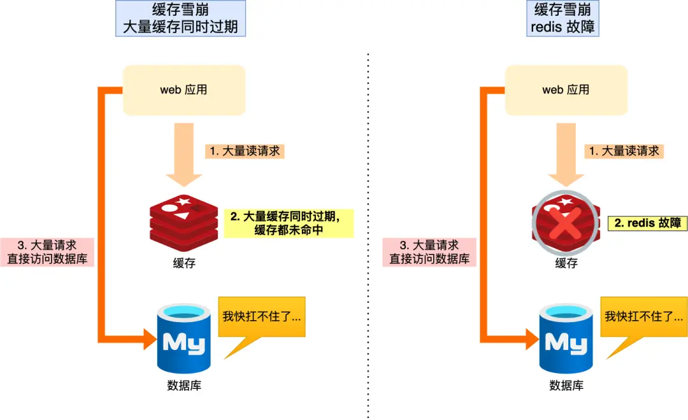

## 基本数据结构
- string
- hash
- list
- set 集合
- zset 有序集合

### 应用场景
- String： 缓存对象、常规计数、分布式锁、共享 session
- List： 消息队列（但是有两个问题：1. 生产者需要自行实现全局唯一 ID；2. 不能以消费组形式消费数据）等
- Hash： 缓存对象、购物车等。
- Set: 聚合计算（并集、交集、差集）场景，比如点赞、共同关注、抽奖活动等
- Zset: 排序场景，比如排行榜、电话和姓名排序等。
- BitMap（2.2 版新增）：二值状态统计的场景，比如签到、判断用户登陆状态、连续签到用户总数等；
- HyperLogLog（2.8 版新增）：海量数据基数统计的场景，比如百万级网页 UV 计数等；【数据可能有偏差】
- GEO（3.2 版新增）：存储地理位置信息的场景，比如滴滴叫车；
- Stream（5.0 版新增）：消息队列，相比于基于 List 类型实现的消息队列，有这两个特有的特性：自动生成全局唯一消息ID，支持以消费组形式消费数据。

### 常见的数据类型是怎么实现的

## Redis 的单线程为什么那么快？
- 在内存中运行
- I/O 多路复用机制
### I/O多路复用实现方式对比

#### 1. select
- **机制**：轮询所有文件描述符（FD），通过位图（`fd_set`）检查就绪事件。
- **平台支持**：所有主流平台（Linux/Windows/macOS等）。
- **最大FD数**：固定限制（`FD_SETSIZE`，默认为1024）。
- **时间复杂度**：`O(n)`，每次需遍历所有FD。
- **触发模式**：水平触发（LT）。
- **内存拷贝**：每次调用需将FD集合从用户态拷贝到内核态。
- **优点**：跨平台支持广泛，接口简单。
- **缺点**：FD数量受限，效率随连接数线性下降，重复拷贝开销大。

#### 2. poll
- **机制**：类似`select`，但通过链表（`pollfd`结构体）管理FD，无固定大小限制。
- **平台支持**：多数Unix-like系统（如Linux/macOS）。
- **最大FD数**：理论无限制（受系统资源约束）。
- **时间复杂度**：`O(n)`，仍需遍历所有FD。
- **触发模式**：水平触发（LT）。
- **内存拷贝**：每次调用需传递完整的`pollfd`数组。
- **优点**：无FD数量硬限制。
- **缺点**：拷贝开销大，效率仍为`O(n)`。

#### 3. epoll
- **机制**：事件驱动，内核通过红黑树维护事件表，仅返回就绪的FD。
- **平台支持**：Linux专属。
- **最大FD数**：系统资源限制（可支持数十万连接）。
- **时间复杂度**：`O(1)`，仅处理就绪事件。
- **触发模式**：支持水平触发（LT）和边缘触发（ET）。
- **内存拷贝**：通过`epoll_ctl`注册FD，`epoll_wait`直接获取就绪事件（利用`mmap`减少拷贝）。
- **优点**：高性能，适合高并发场景，支持ET模式。
- **缺点**：仅限Linux，API较复杂。

#### 4. kqueue
- **机制**：事件驱动，通过`kevent`结构体管理事件，类似`epoll`。
- **平台支持**：BSD系系统（FreeBSD/macOS）。
- **最大FD数**：系统资源限制。
- **时间复杂度**：`O(1)`，高效处理就绪事件。
- **触发模式**：支持多种事件类型（如文件状态变化、信号等）。
- **内存拷贝**：通过`kevent`注册事件，内核直接返回就绪事件。
- **优点**：高性能，支持丰富的事件类型。
- **缺点**：仅限BSD系，接口复杂。

---

#### 对比表格

| 特性               | select                          | poll                            | epoll                           | kqueue                          |
|---------------------|---------------------------------|---------------------------------|---------------------------------|---------------------------------|
| **平台支持**        | 全平台                          | Unix-like                       | Linux                           | BSD系（如FreeBSD/macOS）        |
| **最大FD数**        | 1024（可调整但效率低）          | 系统资源限制                    | 系统资源限制                    | 系统资源限制                    |
| **时间复杂度**      | O(n)                           | O(n)                           | O(1)                           | O(1)                           |
| **触发模式**        | 水平触发（LT）                  | 水平触发（LT）                  | 支持LT/ET                       | 支持LT/ET及更多事件类型         |
| **内存拷贝**        | 每次调用全量拷贝FD集合          | 同select                        | 注册时增量更新，等待时不拷贝    | 同epoll                         |
| **适用场景**        | 低并发或跨平台                  | 替代select（FD数较多时）        | Linux高并发                     | BSD系高并发                     |

---

#### 总结
- **select/poll**：适合低并发或跨平台场景，但性能瓶颈明显。
- **epoll**：Linux高并发首选，需注意ET模式需搭配非阻塞IO。
- **kqueue**：BSD系系统的`epoll`替代方案，功能更丰富。
- **通用建议**：优先使用操作系统原生高性能模型（如`epoll`/`kqueue`），跨平台需求可依赖封装库（如`libevent`/`libuv`）。

## 宕机了，数据怎么快速恢复：redis 的持久化
### AOF
    
先执行redis 命令，在将命令写入到日志中，这样的好处就是不会阻碍当前的写操作，
但是潜在风险：1.如果执行完命令就宕机了，这个命令和相应的数据就会丢失；2.虽然不会阻碍当前的写操作，但是会给下一个操作带来阻碍的风险

### AOF 的三种回写操作：作用就是减少数据丢失的风险
1. alawys： 同步写回，每个写命令执行完，就同步的将日志写回磁盘
2. everysec：每秒写回，每次命令执行完，就先写入内存缓冲区，每隔一秒把缓冲区的日志写回磁盘
3. no：由操作系统控制写回，每个写命令执行完，先把日志写入 aof 文件的内存缓冲区，由操作系统来决定什么时候将缓冲区写入磁盘

### AOF 日志过大，会触发什么机制？AOF 的重写机制

作用：解决 AOF 文件过大带来的问题
1. 文件系统的限制，无法保存较大的文件
2. 如果文件过大，会给写入日志带来较大的性能挑战，性能低
3. 宕机恢复，AOF 文件过大，会导致数据恢复慢，执行效率低

AOF 重写的主要思想：就是将多条写入命令，最后合并成一条命令执行

AOF 重写会阻塞吗？不会
1. 是由子进程  bgrewriteaof 来完成的
2. 一个拷贝，两处日志：一个拷贝时指每次重写时，主线程会 fork 一个子线程，把内存拷贝一份给子线程，这里就包含最新的数据，子线程可以在不影响主线程的情况下操作；两处日志: 正在使用的 aof 日志；新的 aof 重写日志
3. 总结来说，每次 aof 重写时，redis 都会先执行一个内存拷贝，用于重写，然后两个日志在重写的过程中，新写入的数据不会丢失

在重写 AOF 期间，当 Redis 执行完一个写命令之后，它会同时将这个写命令写入到 「AOF 缓冲区」和 「AOF 重写缓冲区」。

### RDB
将某一时刻的内存数据，以二进制的方式写入磁盘；数据的恢复效率比 AOF 高
#### RDB 会阻塞主线程吗？
由两个生成 RDB 文件的命令来决定的：save 和 bgsave
1. 使用 save，就会在主线程生成 RDB 文件，如果生成 RDB 文件的时间过长，就会阻碍主线程
2. bgsave，会创建一个子进程来生成 RDB 文件，这样可以避免阻塞主线程
## 数据同步，主从数据库怎么实现数据一致
主从复制
### 第一次同步
1. 第一阶段是建立链接、协商同步
2. 第二阶段是主服务器同步数据给从服务器；
3. 第三阶段是主服务器发送新写操作命令给从服务器。

主从服务器在完成第一次同步后，双方之间就会维护一个 TCP 连接。
### 分摊主服务器的压力
主从复制的耗时主要在 生成 RDB 文件和传输 RDB 文件，如果 redis的多个从服务器都从主服务器全量同步，就会阻塞主服务器线程，无法提供服务，也会给占用主服务器的网络带宽，对主服务器响应命令产生影响

解决办法：让从服务器来同步数据，主服务器生成 RDB 和传输 RDB 的压力可以分摊到充当经理角色的从服务器。

### 增量复制
主从服务器在完成第一次同步后，就会基于长连接进行命令传播，如果出现了网络问题断开连接，就可以用增量复制的方式进行同步

### 如何判断从哪里开始复制？
repl_backlog_buffer：【环形】缓冲区，在主服务器进行命令传播时，不仅会将写命令发送给从服务器，还会将写命令写入到 repl_backlog_buffer 缓冲区里，因此 这个缓冲区里会保存着最近传播的写命令
## 主库挂了，如何不间断服务：哨兵机制
哨兵机制的作用：主从节点故障转移
### 哨兵的主要工作
哨兵节点主要负责三件事情：监控、选主、通知。
### 如何判断主节点故障
哨兵会每隔一秒 ping 主节点，如果主节点在规定的时间内没有响应，就会被判定为主观下线，
这个时候哨兵就会给其他哨兵发起命令来判断主节点是否是客观下线，由哨兵们根据自身的网络状态投票，如果票数达到了【配置文件中的 quorum 配置项】，就会被判断为客观下线，这个时候就会发起故障转移
### 由哪个哨兵来进行主从故障转移
当主节点被判定为客观下线，最先发现的哨兵就会发起投票，来做这次故障转移的 leader，如果票数大于等于哨兵配置文件中的 quorum 值或者拿到半数以上的赞成票就会成为 leader 进行故障转移
### 主从故障转移的过程是怎样的？
- 选出一个从节点将其转换为主节点【从节点如何选择】
  - 过滤掉已经离线和网络不好的从节点
  - 将剩下的节点进行三轮考察，顺序从优先级、复制进度、ID 号筛选，一轮胜利就会作为主节点
- 将已下线的旧主节点的从节点，改为复制新主节点
- 将新主节点的服务器信息，通过 发布者/订阅者机制 发送给客户端
- 继续监视旧主节点，等它重新上线，将其设置为新主节点的从节点

## Redis 的过期删除和内存淘汰
### 过期策略有哪些?
- 定时删除
- 惰性删除
- 定期删除

#### 定时删除的策略是怎样的
在设置 key 的过期时间时，同时创建一个定时事件，当时间到达时，由事件处理器自动执行 key 的删除操作。

优点：
- 可以保证过期的 key 能尽快的被删除，快速的释放内存，对内存最为友好

缺点：
- 过期 key 过多的情况下，会占用 cpu 时间，在 cpu 紧张的情况下，会影响服务器的响应时间和吞吐量

#### 惰性删除策略
不主动删除过去 key，每次访问时检查是否过期，如果过期了就删除 key

优点：
- 因为每次访问再去检查是否过期，对资源占用少，对 cpu 友好

缺点：
- 如果过期的 key 长期没有被删除，会占用内存空间

#### 定期删除策略
每隔一段时间，从数据库中随机抽取一批 key进行检查，如果过期了就删除

优点：
- 通过限制删除操作执行的时长和频率，来减少删除操作对 CPU 的影响，同时也能删除一部分过期的数据减少了过期键对空间的无效占用。

缺点：
- 内存清理方面没有定时删除效果好，同时没有惰性删除使用的系统资源少。
- 难以确定删除操作执行的时长和频率。如果执行的太频繁，定期删除策略变得和定时删除策略一样，对CPU不友好；如果执行的太少，那又和惰性删除一样了，过期 key 占用的内存不会及时得到释放。

#### redis 的删除策略是什么
Redis 选择「惰性删除+定期删除」这两种策略配和使用，以求在合理使用 CPU 时间和避免内存浪费之间取得平衡。
### 内存淘汰策略有哪些？
#### 不进行内存淘汰【noeviction】
redis 3.0 之后的默认策略，当内存满了，会给客户端报错，不然其继续写入
#### 在设置了过期时间的数据中进行淘汰
##### volatile-random
淘汰设置了过期时间的任意键值
##### volatile-ttl
优先淘汰更早过期的键值
##### volatile-lru
Redis3.0 之前，默认的内存淘汰策略）淘汰所有设置了过期时间中最久未使用的键值
##### volatile-lfu
Redis 4.0 后新增的内存淘汰策略）淘汰所有设置了过期时间中最少使用的键值
#### 在所有数据中淘汰
##### allkeys-random
随机淘汰任意键值;
##### allkeys-lru
淘汰整个键值中最久未使用的键值；
##### allkeys-lfu
Redis 4.0 后新增的内存淘汰策略）：淘汰整个键值中最少使用的键值。

## 如何避免缓存雪崩、缓存击穿、缓存穿透？
### 雪崩
大量 redis 同一时间过期或者 redis 宕机，大流量都直接请求到数据库

#### 解决办法：针对不同诱因，策略也有所不同
#### 大量数据同时过期
- 均匀的设置过期时间：保证在同一时间没有大量的缓存同时失效
- 互斥锁：只允许一个请求来构建缓存，最好加个超时时间，不然遇到阻塞会影响到整个业务
- 后台更新缓存：定时更新或者缓存被淘汰时通知后台业务更新缓存
#### redis 宕机
- 服务熔断或请求限流机制：暂停对业务的访问，直接返回错误，减少对数据库的压力
- 构建高可用的集群

### 缓存击穿

缓存的热点数据突然失效，导致流量直接打到数据库
#### 解决办法
- 不给缓存设置过期时间，由业务来更新缓存
- 互斥锁方案
### 缓存穿透
用户访问的数据，既不在缓存中，也不在数据库中

#### 解决办法
- 限制非法请求
- 缓存空值或者零值
- 使用布隆过滤器，快速判断数据是否存在

## 数据如何和缓存保持一致
### 延迟双删：先删除缓存，更新数据库，在删除缓存

### 先更新数据库，在删除缓存
如果出现第二部操作失败，也会导致数据不一致

解决办法：
- 重试机制：利用消息队列来进行重试，如果失败就再次消费
- 订阅 mysql 的 binlog 日志，通过 binlog 日志拿到具体要操作的数据，然后再执行删除缓存操作

### 为什么是删除缓存不是更新缓存
删除一个数据，相比更新一个数据更加轻量级，出问题的概率更小。而且在业务中，有的缓存是多张表聚合而成，操作会非常耗时。
从另外一个角度，不是所有的缓存数据都是频繁访问的，更新后的缓存可能会长时间不被访问，所以说，从计算资源和整体性能的考虑，
更新的时候删除缓存，等到下次查询命中再填充缓存，是一个更好的方案

### 如何拆分一个存储百万字段的 hash key
- 垂直拆分，按业务维度将hash 拆分为多个子key，比如按订单号之类的
- 分片存储，对 hash key 进行分片
- go：使用一致性哈希算法选择分片节点

### Redis内存使用过高如何定位和优化？
- 定位：INFO MEMORY、redis-cli --bigkeys；
- 优化：拆分大Key、设置过期时间、使用高效数据结构（如Hash代替多个String）。